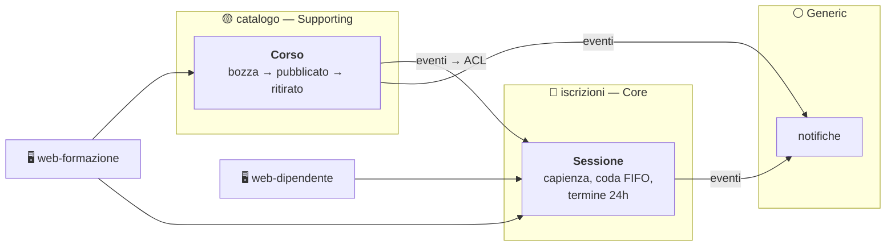

# Academy Interna — la documentazione

Esercizio di **Domain Driven Design**: formazione interna aziendale, con catalogo corsi,
sessioni a posti limitati e lista d'attesa.

L'obiettivo non è il software funzionante, è il **percorso che porta dal dominio al codice**.
Per questo la documentazione precede l'implementazione, e questa cartella è, al momento,
l'intero progetto.

---

## I documenti, in ordine

Vanno letti in sequenza: ognuno chiude ciò che il precedente ha lasciato aperto, e nessuno
anticipa decisioni che spettano al successivo.

| # | Documento | La domanda a cui risponde |
|---|---|---|
| 1 | **[event-storming.md](event-storming.md)** | Cosa **accade** nel dominio: eventi, comandi, attori, policy — e cosa non torna |
| 2 | **[domain.md](domain.md)** | Dove passano i **confini**: sottodomini, bounded context, come si parlano |
| 3 | **[aggregation.md](aggregation.md)** | Chi **custodisce** quale invariante: aggregati, entità, value object |
| 4 | **[architecture.md](architecture.md)** | Come diventa **codice**: contratti, persistenza, guardiani, test |

**Si comincia dall'event storming**, non da una specifica. Non esiste un documento a monte che
detti requisiti o scelte tecniche: c'è il dominio raccontato — che sta in `event-storming.md`
§1.0, dove serve — e da lì tutto è derivato, un documento alla volta. Ogni scelta tecnica
compare nel momento in cui il dominio la rende necessaria, mai prima.

---

## Il modello, in un diagramma

**Due aggregati in tutto il sistema.** È poco, ed è il segno che i confini sono stati tracciati
sul verbo — *decidere* — e non sul sostantivo. Il core è `iscrizioni`, perché è l'unico punto in
cui una regola sbagliata produce un danno visibile: due persone sullo stesso posto, o qualcuno
scavalcato in coda.

**Due app, tre contesti, e non si corrispondono.** `web-formazione` attraversa due bounded
context, e va bene così: il contesto è un confine di modello e di transazione, non di schermata.
Un'app per attore, e gli attori che formulano comandi sono due — il terzo è il Sistema, che non
ha interfaccia. Il backend non sa quante app esistono: i suoi moduli sono i contesti.

**Niente autenticazione né autorizzazione.** Nessun ruolo, nessun permesso, nessun 403: il
client dichiara chi è con l'header `X-Utente` e il sistema gli crede. Resta solo
l'identificazione, perché INV-9 — «nessuno annulla l'iscrizione di un altro» — è una regola di
dominio e ha bisogno di un soggetto. Il taglio non tocca una riga di `domain/`: gli aggregati
non hanno mai avuto un `if` su `ruolo`.

---

## Le quattordici decisioni

Ogni voce è un hotspot: un punto in cui la risposta non era ovvia. Le prime sei si vedono già
leggendo il racconto del committente, le altre otto sono emerse facendo event storming.

| # | Domanda | Decisione | Dove è argomentata |
|---|---|---|---|
| 1 | La sessione sta nel catalogo o nelle iscrizioni? | In **iscrizioni**: custodisce ciò su cui decide | `domain.md` §2.5 |
| 2 | Capienza ridotta sotto gli iscritti? | **Si rifiuta**, nessuno viene espulso | `aggregation.md` §3.6 |
| 3 | La coda è dentro la sessione? | **Dentro**: una transazione sola | `aggregation.md` §3.6 |
| 4 | La promozione è transazionale o reattiva? | **Transazionale** | `aggregation.md` §3.6 |
| 5 | Esiste «cambia sessione»? | **No**: annulla e iscriviti, con sequenza guidata | `aggregation.md` §3.6 |
| 6 | Il docente è entità o attributo? | **Value object** | `domain.md` §2.6 |
| 7 | Chi difende l'unicità del titolo? | **La persistenza**, tradotta in eccezione di dominio | `aggregation.md` §3.7, `architecture.md` §4.7 |
| 8 | Come sa, chi programma, se il corso è pubblicato? | **Replica ACL**; l'inconsistenza si ripara da sola | `domain.md` §2.7 |
| 9 | Che ne è della coda a sessione iniziata? | Nessuna transizione: decadenza derivata nel read model | `aggregation.md` §3.8 |
| 10 | Da dove viene l'indirizzo di chi va avvisato? | **Viaggia dentro l'evento** | `domain.md` §2.8 |
| 11 | «Nessuno annulla l'iscrizione di un altro» dove vive? | Nel dominio **e** nella forma della rotta | `aggregation.md` §3.9 |
| 12 | Un corso ritirato si ripubblica? | **No**, `RITIRATO` è terminale | `aggregation.md` §3.8 |
| 13 | Si modificano data, luogo, docente? | **No**, solo la capienza | `aggregation.md` §3.8 |
| 14 | Aumentare la capienza scorre la coda? | **Sì**, nella stessa transazione | `aggregation.md` §3.6 |

Le decisioni 3, 4 e 14 hanno tutte lo stesso argomento decisivo, ed è un'invariante che il
committente non ha mai pronunciato: **se ci sono posti liberi, la coda è vuota** (INV-8). Nasce
dall'incrocio di due regole dette, e senza di essa quelle tre scelte sarebbero questione di
gusto. È il singolo risultato più utile dell'event storming — vedi `event-storming.md` §1.8.

---

## Dove trovare cosa

| Se cerchi… | Vai a |
|---|---|
| L'elenco degli eventi di dominio | `event-storming.md` §1.3 |
| L'elenco dei comandi e chi li formula | `event-storming.md` §1.4 |
| Le dodici invarianti, e chi custodisce ciascuna | `aggregation.md` §3.5 |
| Cosa contiene esattamente un aggregato | `aggregation.md` §3.2, §3.3 |
| Lo schema dati di un comando | `architecture.md` §4.2 |
| Il payload di un evento e il suo nome sul bus | `architecture.md` §4.3 |
| Quale stato HTTP produce un rifiuto | `architecture.md` §4.4 |
| Le rotte HTTP | `architecture.md` §4.6 |
| Archivio in memoria, snapshot, lock ottimistico | `architecture.md` §4.7 |
| Idempotenza e ordine degli handler | `architecture.md` §4.8 |
| Perché lo stato sta in memoria e non in un database | `architecture.md` §4.1 |
| Le regole ESLint e i test di contratto | `architecture.md` §4.9 |
| L'elenco dei test da scrivere, uno per invariante | `architecture.md` §4.10 |
| Il dominio raccontato, e le regole in lingua d'affari | `event-storming.md` §1.0 |
| Cosa è dichiarato fuori perimetro | `event-storming.md` §1.0 |
| Stack, e perché **non** è Event Sourcing | `architecture.md` §4.1 |

---

## Come leggere le sigle

| Sigla | Significa | Esempio |
|---|---|---|
| **INV-n** | Invariante: una regola sempre vera. Dodici in tutto | INV-4 «iscritti ≤ capienza» |
| **HS-n** | Hotspot: un punto di decisione non ovvia. Quattordici, tutti chiusi | HS-4 «promozione transazionale» |
| **Pn** | Policy: «ogni volta che accade X, allora Y» | P2 «il ritiro annulla le sessioni future» |
| **Rn** | Read model: una lettura per l'interfaccia | R1 «sessioni aperte con posti residui» |
| **§x.y** | Sezione di un documento | `aggregation.md` §3.6 |

Le sigle sono stabili fra i documenti: `INV-8` significa la stessa cosa ovunque compaia.

---

## Percorsi di lettura

**Ho dieci minuti e voglio capire l'esercizio.** Questo README, poi `event-storming.md` §1.0
(il dominio in parole del committente, due pagine), `domain.md` §2.1 (perché
`iscrizioni` è il core) e `aggregation.md` §3.6 (le quattro decisioni sul core, che sono il
cuore di tutto).

**Sto per scrivere il codice.** `aggregation.md` per intero — è ciò che diventa `domain/` —
poi `architecture.md` §4.2, §4.3, §4.4 per i contratti e §4.9 per i guardiani da configurare
prima di scrivere la prima riga, non dopo.

**Devo capire una decisione presa.** La tabella delle quattordici decisioni qui sopra: ogni
riga rimanda alla sezione che la argomenta, con il costo accettato dichiarato.

**Voglio contestare una decisione.** Ogni hotspot chiuso ha, dove ha senso, un paragrafo «cosa
lo farebbe cambiare»: dice quale nuovo requisito renderebbe corretta la scelta opposta. È il
punto da cui riaprire la discussione.

---

## Le discipline che il codice dovrà rispettare

Poche, e imposte da guardiani automatici invece che dalla buona volontà — la configurazione è
in `architecture.md` §4.9.

- **Il dominio non conosce il framework.** Test brutale: cancellando `infrastructure/`, il
  dominio compila ancora.
- **La dipendenza punta verso l'interno.** `domain` non importa da `application` né da
  `infrastructure`; conosce solo le porte che ha definito lui.
- **`iscrizioni` e `catalogo` non si importano.** Se serve un dato, arriva per evento e passa
  dall'ACL.
- **Nessuna foreign key fra moduli.** Il `corsoId` dentro `iscrizioni` è una copia, non un
  riferimento.
- **Niente `new Date()`** in `domain/` e `application/`: il tempo arriva dalla porta `Orologio`.
- **Validare nel DTO non basta.** La stessa regola vive anche nel value object.

---

## Stato

| | |
|---|---|
| ✅ | I quattro documenti esistono, e tutti e 14 gli hotspot sono chiusi con una decisione motivata |
| ⬜ | Backend: un progetto NestJS, moduli per contesto, event bus in-process, read model, notifiche via log |
| ⬜ | `pnpm lint` a zero warning, guardiani architetturali inclusi |
| ⬜ | Cancellando `infrastructure/`, il dominio compila ancora |
| ⬜ | Test di dominio sotto il secondo, leggibili come le regole di `event-storming.md` §1.0 |
| ⬜ | Frontend: due app, quattro viste, pacchetti condivisi |

Il criterio che ha arbitrato ogni decisione di questi documenti, e che vale identico per ogni
riga di codice che seguirà:

> Questa decisione rende **più visibile** il modello di dominio, o lo nasconde dietro
> l'infrastruttura?
