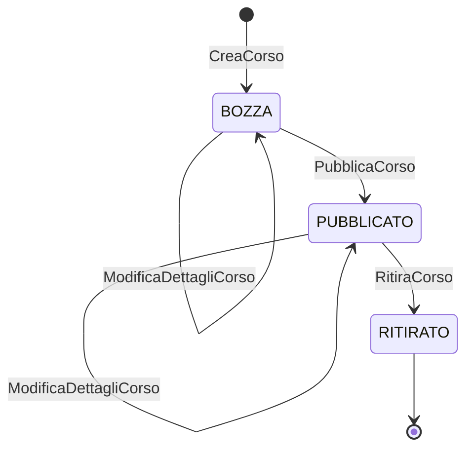
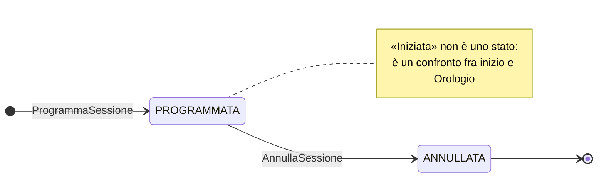
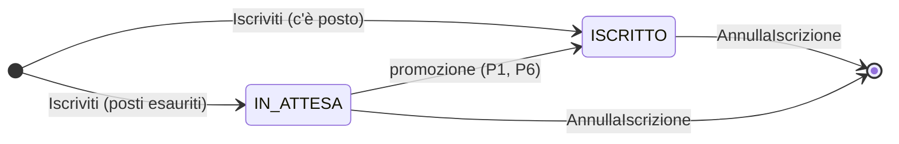

# 3. Aggregati, entità e value object

Terzo dei quattro documenti. Prende i contesti definiti in `domain.md` e ne stabilisce la
struttura interna: quali aggregati esistono, cosa contengono, e — la domanda che conta —
**chi custodisce quale invariante**.

Chiude tutti gli hotspot rimanenti: **HS-2**, **HS-3**, **HS-4**, **HS-5**, **HS-7**, **HS-9**,
**HS-11**, **HS-12**, **HS-13**, **HS-14**.

---

## 3.1 Il criterio di aggregazione

Un aggregato è **un confine di consistenza transazionale**: ciò che deve essere vero
*insieme*, nello stesso istante, viene tenuto insieme. Tutto il resto sta fuori e si accontenta
di diventare vero poco dopo.

Da questo criterio discendono tre regole applicate in tutto il documento:

1. **Un comando modifica un aggregato solo.** Se un caso d'uso ne tocca due, o gli aggregati
   sono sbagliati, o la seconda modifica è una policy reattiva.
2. **L'aggregato si carica e si salva per intero.** Non si legge «la sessione senza le
   iscrizioni»: senza le iscrizioni non può difendere INV-4.
3. **Fuori dal confine si referenzia per identificativo**, mai per oggetto.

Il risultato sono **due soli aggregati** in tutto il sistema. È poco, ed è il segno che i
confini sono stati tracciati sul verbo — decidere — e non sul sostantivo.

| Contesto | Aggregato | Radice | Custodisce |
|---|---|---|---|
| `catalogo` | **Corso** | `Corso` | Ciclo di vita del corso, validità dei dettagli |
| `iscrizioni` | **Sessione** | `Sessione` | Posti, coda, termine di annullamento, stato |
| `notifiche` | — | — | Nessuno stato di dominio |

---

## 3.2 Aggregato `Corso` — contesto `catalogo`

```
Corso  (radice)
├── id            : CorsoId          VO — identificativo opaco
├── titolo        : TitoloCorso      VO — non vuoto, ≤ 200 caratteri, normalizzabile
├── descrizione   : Descrizione      VO — non vuota, ≤ 2000 caratteri
├── durataInOre   : DurataInOre      VO — intero, 1…200
├── argomento     : Argomento        VO — non vuoto, ≤ 100 caratteri
├── stato         : StatoCorso       enum — BOZZA | PUBBLICATO | RITIRATO
└── versione      : number           lock ottimistico
```

Nessuna entità interna: il corso è una radice con soli value object. È il profilo tipico di un
aggregato **supporting**, ed è un'informazione utile — se avesse richiesto una gerarchia,
varrebbe la pena chiedersi se sia davvero supporting.

### Ciclo di vita



`RITIRATO` è **terminale**: un corso ritirato non si ripubblica e non si modifica. La ragione
è in HS-12 (§3.8).

### Comportamento

| Metodo | Verifica | Emette | Rifiuta con |
|---|---|---|---|
| `Corso.crea(id, titolo, descrizione, durata, argomento)` | validità dei VO | `CorsoCreato` | — |
| `modificaDettagli(titolo, descrizione, durata, argomento)` | stato ≠ `RITIRATO` | `DettagliCorsoModificati` | `CorsoRitiratoNonModificabile` |
| `pubblica()` | stato = `BOZZA` | `CorsoPubblicato` | `TransizioneCorsoNonAmmessa` |
| `ritira()` | stato = `PUBBLICATO` | `CorsoRitirato` | `TransizioneCorsoNonAmmessa` |

---

## 3.3 Aggregato `Sessione` — contesto `iscrizioni`

Il cuore dell'esercizio.

```
Sessione  (radice)
├── id                : SessioneId       VO
├── corsoId           : CorsoId          VO — copia replicata, non un riferimento
├── titoloCorso       : TitoloCorso      VO — copia replicata, per lo storico
├── inizio            : IstanteLocale    VO — DataLocale + OraLocale
├── luogo             : Luogo            VO — Aula(nome) | Online
├── docente           : Docente          VO — nome non vuoto        (HS-6)
├── capienza          : Capienza         VO — intero ≥ 1            (INV-3)
├── stato             : StatoSessione    enum — PROGRAMMATA | ANNULLATA
├── motivoAnnullamento: MotivoAnnullamento?  enum — DECISIONE_RESPONSABILE | CORSO_RITIRATO
├── iscrizioni        : Iscrizione[]     entità interne, ordinate       (HS-3)
└── versione          : number           lock ottimistico

Iscrizione  (entità interna — identità locale: dipendenteId)
├── dipendenteId  : DipendenteId     VO
├── email         : Email            VO — dato di contatto replicato    (HS-10)
├── stato         : StatoIscrizione  enum — ISCRITTO | IN_ATTESA
└── ordine        : number           progressivo di arrivo nella sessione (INV-7)
```

### Perché `Iscrizione` è un'entità e non un value object

Ha un'**identità locale** — il `dipendenteId` — e uno **stato che cambia nel tempo** restando
la stessa iscrizione: chi viene promosso da `IN_ATTESA` a `ISCRITTO` non diventa un'altra
iscrizione, è la stessa persona con un esito migliore. È identità *dentro* il confine: non
esiste un modo di riferire un'`Iscrizione` da fuori l'aggregato, e non serve.

### Il campo `ordine`, e perché non è un timestamp

INV-7 richiede una coda **senza pari merito**. Ordinare per istante di iscrizione sembra
naturale ed è fragile: due iscrizioni nello stesso millisecondo producono un ordine indefinito,
e l'ordine indefinito in una coda equa è precisamente il difetto che il committente ha chiesto
di non avere. `ordine` è un intero progressivo assegnato dall'aggregato — che li vede tutti — e
per costruzione non ha collisioni. Effetto collaterale gradito: la coda è **deterministica nei
test**, senza toccare l'orologio.

### Ciclo di vita



**«Iniziata» non è uno stato dell'aggregato.** È un predicato calcolato: `inizio ≤ adesso`.
Renderlo uno stato avrebbe richiesto qualcuno che compia la transizione — uno scheduler — cioè
un pezzo di infrastruttura in più per rappresentare il semplice passare del tempo. Il tempo
arriva dalla porta `Orologio` e la sessione lo confronta quando deve decidere.

### Ciclo di vita di `Iscrizione`



### Comportamento

| Metodo | Verifica | Emette | Rifiuta con |
|---|---|---|---|
| `Sessione.programma(id, corso, inizio, luogo, docente, capienza, adesso)` | corso pubblicato nella replica (INV-2), capienza ≥ 1 (INV-3), `inizio > adesso` | `SessioneProgrammata` | `CorsoNonPubblicato`, `CapienzaNonValida`, `SessioneNelPassato` |
| `iscrivi(dipendenteId, email, adesso)` | non annullata (INV-6), non iniziata (INV-6), non già presente (INV-5) | `DipendenteIscritto` **oppure** `DipendenteMessoInAttesa` | `SessioneAnnullataNonIscrivibile`, `SessioneGiaIniziata`, `IscrizioneDuplicata` |
| `annullaIscrizione(dipendenteId, adesso)` | presente (INV-9), `adesso < inizio − 24h` (INV-10), non annullata | `IscrizioneAnnullata` **+** `DipendentePromosso`? **oppure** `AttesaAnnullata` | `IscrizioneNonTrovata`, `AnnullamentoFuoriTermine`, `SessioneAnnullataNonIscrivibile` |
| `modificaCapienza(nuova, adesso)` | ≥ 1 (INV-3), ≥ numero iscritti (HS-2), non annullata, non iniziata | `CapienzaSessioneModificata` **+** `DipendentePromosso` × n | `CapienzaNonValida`, `CapienzaInferioreAgliIscritti`, … |
| `annulla(motivo)` | stato = `PROGRAMMATA` (INV-12) | `SessioneAnnullata` | `SessioneGiaAnnullata` |

Il punto da notare in tutta la tabella: **`iscrivi` non ha «posti esauriti» fra i rifiuti**.
Posti esauriti non è un errore, è l'altro esito. È la traduzione fedele di «se i posti sono
esauriti non viene respinto», e se comparisse come eccezione vorrebbe dire che il modello ha
smesso di raccontare la stessa storia del committente.

---

## 3.4 L'invariante centrale, scritta una volta sola

Tutto l'aggregato `Sessione` esiste per mantenere vera, dopo ogni metodo, questa congiunzione:

```
numeroIscritti ≤ capienza                                    (INV-4)
numeroIscritti < capienza  ⟹  listaDAttesa è vuota           (INV-8)
gli ordini sono distinti e crescenti nell'arrivo             (INV-7)
ogni dipendenteId compare al più una volta                   (INV-5)
```

Espressa come un unico metodo privato invocato in coda a ogni comando — `assicuraCoerenza()` —
diventa una rete di sicurezza contro le regressioni future, e costa cinque righe.

Da INV-4 e INV-8 insieme segue la formulazione operativa della promozione: **finché la coda non
è vuota, non esistono posti liberi**. Chi annulla non «libera un posto»: consegna il proprio
posto al primo della coda, nello stesso atto. È questa lettura che chiude HS-4.

---

## 3.5 Chi custodisce quale invariante

La tabella che `event-storming.md` §1.8 ha lasciato in bianco.

| # | Invariante | Custode | Consistenza |
|---|---|---|---|
| **INV-1** | Titoli dei corsi distinti | ⚠️ **Nessun aggregato** — vincolo di unicità in persistenza | Immediata, ma fuori dal dominio → HS-7 |
| **INV-2** | Sessione solo per corso pubblicato | `Sessione.programma`, contro la replica ACL | **Eventuale** (HS-8), auto-riparante |
| **INV-3** | Capienza ≥ 1 | VO `Capienza` | Immediata |
| **INV-4** | Iscritti ≤ capienza | `Sessione` | Immediata |
| **INV-5** | Nessun doppione per sessione | `Sessione` | Immediata |
| **INV-6** | Niente ingressi in sessione iniziata o annullata | `Sessione` (+ porta `Orologio`) | Immediata |
| **INV-7** | Coda in ordine d'arrivo, senza pari merito | `Sessione`, campo `ordine` | Immediata |
| **INV-8** | Posti liberi ⟹ coda vuota | `Sessione` | Immediata |
| **INV-9** | Solo il titolare annulla la propria iscrizione | `Sessione.annullaIscrizione` **e** forma della rotta | Immediata → HS-11 |
| **INV-10** | Annullamento entro le 24 ore precedenti | `Sessione` (+ porta `Orologio`) | Immediata |
| **INV-11** | Il ritiro annulla le sessioni future, non le passate | ⚠️ **Policy P2**, non un aggregato | **Eventuale** |
| **INV-12** | Una sessione annullata non torna attiva | `Sessione.annulla` | Immediata |

Dieci invarianti su dodici sono difese da un aggregato, in memoria, senza database. È il numero
che rende sensata la piramide di test rovesciata di `architecture.md` §4.10. Le due eccezioni —
INV-1 e INV-11 — non sono difetti: sono **invarianti che attraversano più aggregati**, e nessun
aggregato può custodire ciò che non vede. Vanno però dichiarate, perché il costo di
un'invariante eventualmente consistente scoperta a runtime è molto più alto di quello di
un'invariante eventualmente consistente scritta in un documento.

---

## 3.6 Gli hotspot del core

### 🔥 HS-3 — La lista d'attesa sta **dentro** la sessione

**Decisione.** Le iscrizioni in attesa sono entità interne all'aggregato `Sessione`. Non esiste
un aggregato `ListaDAttesa`.

**Perché.** «Iscritti ≤ capienza» e «la coda scorre in ordine» non sono due regole: sono i due
lati della stessa decisione, presa nello stesso istante sullo stesso dato. Separarle in due
aggregati significherebbe non poterle più decidere insieme — servirebbe un processo a due fasi
per rispondere alla domanda più frequente del sistema, «c'è posto per me?», e INV-8 diventerebbe
eventualmente consistente. Un'invariante che si può violare per un istante è, in una coda equa,
un'invariante che qualcuno userà per scavalcare.

L'argomento a favore della separazione — «la sessione resta più piccola» — è vero e non è
sufficiente. La dimensione di un aggregato è un problema quando la contesa o il volume la
rendono tale; qui la coda è dell'ordine di grandezza della capienza, cioè decine di righe.
Ottimizzare la dimensione peggiorando la garanzia è il verso sbagliato del compromesso.

**Costo accettato.** Ogni iscrizione carica e salva l'intera sessione, comprese tutte le sue
iscrizioni, e ogni iscrizione contende la stessa riga con lock ottimistico. È deliberato: è
**la stessa contesa che il dominio ha realmente** — un posto solo, due persone — resa esplicita
invece che nascosta.

### 🔥 HS-4 — La promozione è nella stessa transazione dell'annullamento

**Decisione.** `annullaIscrizione` promuove il primo della coda **dentro lo stesso metodo, nello
stesso aggregato, nella stessa transazione**. Emette `IscrizioneAnnullata` e
`DipendentePromosso` insieme. Reattiva è soltanto la **notifica** al promosso (P3).

**Perché.** Discende da INV-8, e non è una preferenza. Se la promozione fosse una policy su
evento, esisterebbe una finestra — piccola quanto si vuole, ma reale — in cui il posto è libero
e la coda non è vuota. In quella finestra un dipendente qualsiasi che chiama `Iscriviti` trova
posto e lo prende, legittimamente secondo la regola dei posti, scavalcando chi era in coda da
giorni. Sarebbe letteralmente «il posto va al primo che ricarica la pagina», che è la frase con
cui il committente ha descritto ciò che **non** vuole.

Vale la pena essere espliciti sulla differenza di garanzia, perché è il senso dell'hotspot:

| | Transazionale (scelta) | Reattiva (scartata) |
|---|---|---|
| INV-8 | sempre vera | violata nella finestra |
| Equità della coda | garantita | soggetta a gara |
| Fallimento del dispatcher | irrilevante | posto libero e nessuno promosso |
| Aggregato | fa due cose in un metodo | fa una cosa sola |

L'unico vantaggio della via reattiva è un aggregato leggermente più semplice. Non compra
abbastanza.

**Costo accettato.** L'annullamento fa più lavoro di quanto il suo nome suggerisca, e produce
due eventi. Il metodo va scritto in modo che si legga come la frase del committente: *libera il
posto, e se qualcuno aspetta, il posto è suo*.

### 🔥 HS-14 — Aumentare la capienza scorre la coda

**Decisione.** `modificaCapienza` in aumento promuove immediatamente tanti in attesa quanti
sono i posti nuovi, nella stessa transazione.

**Perché.** Non è una funzionalità aggiuntiva: è INV-8 applicata. Aggiungere tre posti a una
sessione con dieci persone in coda e lasciare i posti liberi produrrebbe uno stato che
l'aggregato dichiara impossibile. La coerenza qui non è una scelta di prodotto, è l'unica
uscita dallo stato inconsistente.

### 🔥 HS-2 — Ridurre la capienza sotto gli iscritti si **rifiuta**

**Decisione.** `modificaCapienza` con un valore inferiore al numero di iscritti attuali è
rifiutata con `CapienzaInferioreAgliIscritti`. Nessuno viene espulso. La riduzione fino al
numero di iscritti è invece ammessa (e non promuove nessuno).

**Perché.** L'alternativa — espellere gli ultimi arrivati — è tecnicamente semplice e
socialmente inaccettabile: revoca il posto a una persona come effetto collaterale invisibile di
un comando amministrativo che parlava di numeri, non di persone. Confligge inoltre con lo
spirito di INV-9: se «nessuno annulla l'iscrizione di un altro», tanto meno lo fa un aggregato
di sua iniziativa.

C'è poi un argomento di modellazione, ed è quello decisivo: se davvero il responsabile deve
togliere il posto a qualcuno, quella è una **decisione umana** che merita un comando proprio,
un motivo e una notifica — non un effetto derivato dell'aritmetica. Ridurre la capienza non è
quel comando.

**Cosa può fare il responsabile a cui serve.** Annullare la sessione e riprogrammarla con la
capienza giusta. È più rumoroso, ed è giusto che lo sia: tutti vengono avvisati, che è
esattamente ciò che accade nella realtà quando si riduce un'aula già piena.

**Costo accettato.** Un caso d'uso legittimo — «l'aula grande non è disponibile, ne ho una da
otto» — richiede due comandi invece di uno, e passa dalla notifica a tutti. Accettabile: è raro,
ed è meglio rumoroso che silenzioso.

### 🔥 HS-5 — «Cambia sessione» non esiste come comando

**Decisione.** Nessun comando `CambiaSessione`. Il dipendente annulla e si iscrive altrove, con
due comandi distinti.

**Perché.** Un comando di cambio toccherebbe **due aggregati** — la sessione lasciata e quella
presa — violando la regola 1 del §3.1. Le uscite sarebbero due, entrambe peggiori: una
transazione che scrive due aggregati, che rinuncia al confine di consistenza proprio nel punto
in cui c'è contesa; oppure una saga con compensazione, cioè un secondo meccanismo di
coordinamento introdotto per un caso d'uso che il committente non ha mai chiesto.

**Il rischio, che è reale.** Fra l'annullamento e la nuova iscrizione il dipendente può trovare
la seconda sessione piena. Ma il rifiuto non è la conseguenza: **finisce in lista d'attesa**,
perché a posti esauriti non si viene respinti. Il caso peggiore è quindi «ho perso il posto in
A e sono in coda per B» — spiacevole, non corrotto.

**Mitigazione, e sta nel frontend.** L'interfaccia propone l'ordine **prima ti iscrivi a B, poi
annulli A**. In quest'ordine il rischio scompare: se B è pieno finisci in coda per B *mentre sei
ancora iscritto ad A*, e decidi con l'informazione in mano. Che la sequenza sicura sia
esprimibile con i comandi esistenti, senza inventarne di nuovi, è la conferma che il comando
dedicato non serve.

**Cosa lo farebbe cambiare.** Un requisito del tipo «chi cambia sessione mantiene la priorità
di prenotazione originale». Quella è una regola sull'*identità della prenotazione* attraverso
due sessioni, e nessuno dei due aggregati la potrebbe difendere: servirebbe un terzo concetto,
una `Prenotazione` con vita propria.

---

## 3.7 🔥 HS-7 — L'unicità del titolo è un vincolo di persistenza, dichiarato

**La tensione.** INV-1 è un'invariante di **insieme**: riguarda la collezione di tutti i corsi,
non un corso. Nessun aggregato `Corso` può difenderla, perché per costruzione non vede gli
altri.

**Le tre uscite possibili**, e perché due si scartano:

1. *Un aggregato «Catalogo» che contiene tutti i corsi.* Difende l'invariante perfettamente e
   serializza ogni scrittura del contesto su un'unica riga. Un aggregato che cresce senza limite
   e che diventa il collo di bottiglia di tutto il modulo — il rimedio è peggiore del male.
2. *Un domain service che interroga il repository prima di salvare.* È il rimedio più diffuso ed
   è **illusorio**: fra la verifica e il salvataggio c'è una finestra, e due richieste
   simultanee con lo stesso titolo la attraversano entrambe. Dà l'apparenza della sicurezza senza
   la sicurezza.
3. *Un vincolo di unicità nel database.* Il solo che regga sotto concorrenza reale.

**Decisione.** Vincolo `UNIQUE` sulla colonna `titolo_normalizzato` (minuscolo, spazi
compattati). Il repository intercetta la violazione del vincolo e la **rilancia come eccezione
di dominio** `TitoloCorsoGiaUsato`. In aggiunta, un controllo preventivo nell'application
service produce lo stesso errore nel caso normale — non per correttezza, ma per non far
dipendere il messaggio d'errore comune dalla gestione di un errore del driver.

**Perché è accettabile che il custode sia l'infrastruttura.** Il criterio arbitro
dell'esercizio è se una decisione rende più visibile il modello o lo nasconde. Qui la
traduzione avviene in **un punto solo e dichiarato** — il repository dei corsi — e ciò che
risale allo strato applicativo è un'eccezione di dominio con un nome del linguaggio ubiquo. Il
dominio non sa cosa sia un indice univoco; sa cosa sia un titolo già usato. Ciò che sarebbe
inaccettabile è il contrario: lasciare che un `SQLITE_CONSTRAINT_UNIQUE` arrivi fino al
controller.

**Costo accettato.** È l'unica invariante che un test di dominio puro non può verificare.
Richiede un test di integrazione, ed è elencato come tale in `architecture.md` §4.10.

---

## 3.8 Gli hotspot del ciclo di vita

### 🔥 HS-9 — La coda decade con l'inizio della sessione, senza transizione

**Decisione.** Nessun comando e nessuno scheduler. Le iscrizioni in attesa di una sessione
iniziata restano in stato `IN_ATTESA` e semplicemente **non sono più promuovibili**: la
promozione avviene solo dentro comandi che l'aggregato già rifiuta su una sessione iniziata. Il
read model «le mie iscrizioni» le presenta come **decadute**, derivando l'etichetta dal
confronto con l'orologio.

**Perché.** Introdurre uno stato `DECADUTA` richiederebbe qualcuno che compia la transizione —
un job periodico — cioè infrastruttura al solo scopo di rappresentare il passare del tempo, che
è già rappresentato dall'`Orologio`. Coerente con la scelta di non fare di «iniziata» uno stato
(§3.3).

**Costo accettato.** Lo stato memorizzato non si legge da solo: `IN_ATTESA` su una sessione
passata significa «non se n'è fatto nulla». La traduzione vive nel read model ed è l'unico
punto in cui esiste.

### 🔥 HS-12 — Un corso ritirato non si ripubblica

**Decisione.** `RITIRATO` è terminale. Le sessioni annullate per `CORSO_RITIRATO` restano
annullate in ogni caso.

**Perché.** L'alternativa apre una domanda senza risposta ragionevole: ripubblicando il corso,
le sessioni annullate resuscitano? Se sì, si dovrebbe riavvisare gente a cui è già stato detto
che non se ne fa nulla, e alcuni potrebbero essersi iscritti altrove — INV-12 salterebbe e con
essa l'idea che un evento sia un fatto. Se no, il ritiro resta distruttivo e la
ripubblicazione è una comodità che non ripara niente.

Se il ritiro è stato un errore, la via è **creare un nuovo corso** e riprogrammare le sessioni.
Costa qualche clic e dice la verità: le vecchie sessioni sono state annullate, e nessuna azione
successiva lo cambia.

**Costo accettato.** Il titolo del corso ritirato resta occupato dal vincolo di unicità (INV-1),
quindi il nuovo corso non può chiamarsi identico. È una conseguenza scomoda e coerente: due
corsi con lo stesso titolo restano due corsi con lo stesso titolo, anche se uno è ritirato.

### 🔥 HS-13 — I dettagli di una sessione non si modificano

**Decisione.** Non esistono comandi per cambiare data, ora, luogo o docente di una sessione
programmata. L'unico dato modificabile è la capienza.

**Perché.** Il committente non l'ha chiesto, e la differenza fra i campi non è arbitraria: la
capienza è l'unico che l'aggregato usa per **decidere**, e la sua modifica ha una semantica
definita da INV-8 (scorre la coda) e da HS-2 (si rifiuta se toglie posti occupati). Gli altri
campi sono il contesto della sessione, e cambiarli significa cambiare l'accordo con chi si è
già iscritto: chi si è iscritto per il martedì mattina in aula 3 non ha acconsentito al giovedì
sera online. Sarebbe un comando che modifica silenziosamente le condizioni di un impegno
altrui — la stessa obiezione di HS-2.

La via corretta esiste già ed è onesta: **annullare e riprogrammare**. Tutti vengono avvisati,
e chi vuole si iscrive alla nuova.

**Cosa lo farebbe cambiare.** Un requisito esplicito di «sposta sessione con notifica ai
partecipanti». Allora sarebbe un comando `RiprogrammaSessione` con un proprio evento
`SessioneRiprogrammata` e una propria notifica — non un `PATCH` sui campi.

**Costo accettato.** Correggere un errore di battitura nel nome del docente richiede di
annullare la sessione. È il caso in cui la decisione costa di più, ed è il prezzo di non avere
una modifica generica che, una volta introdotta, si applicherebbe anche alla data.

---

## 3.9 🔥 HS-11 — INV-9 è dominio **e** forma della rotta

**Decisione.** «Nessuno annulla l'iscrizione di un altro» è difesa in **due punti
indipendenti**:

1. **Nel dominio.** `annullaIscrizione(dipendenteId, adesso)` cerca l'iscrizione di *quel*
   dipendente e solleva `IscrizioneNonTrovata` se non c'è. Non esiste una firma che accetti «la
   terza iscrizione della lista»: l'aggregato non offre il modo di esprimere l'operazione
   vietata.
2. **Nella rotta.** L'endpoint è `DELETE /api/sessions/:id/enrollments/me` — non
   `.../enrollments/:employeeId`. Il dipendente da annullare **non è un parametro**: viene
   dall'`UtenteCorrente`. Un attacco non ha nulla da manomettere perché non c'è alcun campo da
   manomettere.

**Perché due volte.** Sono due domande diverse, esattamente come per la validazione nei DTO:
«questa richiesta HTTP può esprimere l'operazione vietata?» e «questo aggregato può trovarsi in
quello stato?». La prima risposta protegge dall'esterno, la seconda vale anche quando il comando
arriva da un test, da una policy o da un futuro job di importazione.

**Nota su chi può cosa.** Nell'esercizio **non esiste autorizzazione**: nessun ruolo, nessuna
guard, nessun 403. Chiunque raggiunga `POST /api/courses` crea un corso. È una rinuncia
consapevole, e non intacca nulla di questo documento, perché autorizzazione e dominio
rispondono a domande diverse: «hai il permesso di farlo?» contro «di chi è questa iscrizione?».
Il dominio non ha mai conosciuto i ruoli — nessun aggregato ha un solo `if` su `ruolo` — quindi
toglierli non toglie una riga di `domain/`.

INV-9 invece resta, ed è nel dominio proprio perché non parla di permessi: dice *di chi è*
l'iscrizione, che è un fatto del modello. Continua a servire una sola cosa dall'esterno — sapere
quale dipendente sta chiamando — e quella arriva dall'header `X-Utente`, letto in `shared/http`
e iniettato dal controller. Non c'è verifica: il client dichiara e il sistema crede. La difesa
di INV-9 resta comunque intatta, perché non difende da un client che mente sulla propria
identità, ma da un client che tenta di annullare l'iscrizione di **un altro** — e quella strada
non esiste, né nella firma dell'aggregato né nella forma della rotta.

---

## 3.10 Cosa serve al dominio dall'esterno: le porte

Definite **dal dominio**, implementate fuori. Sono l'unica cosa che `domain/` conosce
dell'esistenza di un mondo.

| Porta | Modulo | Firma essenziale | Perché esiste |
|---|---|---|---|
| `Orologio` | `shared/domain` | `adesso(): IstanteLocale` | INV-6 e INV-10 dipendono dal tempo. `new Date()` nel dominio renderebbe la regola delle 24 ore non testabile |
| `GeneratoreDiId` | `shared/domain` | `genera(): string` | Stessa ragione: identificativi deterministici nei test |
| `RepositoryCorsi` | `catalogo/domain` | `perId`, `salva`, `titoloEsiste` | Carica e salva l'aggregato **per intero** |
| `RepositorySessioni` | `iscrizioni/domain` | `perId`, `salva`, `futureDelCorso` | Idem. `futureDelCorso` serve alla policy P2 |
| `CorsiPubblicati` | `iscrizioni/domain` | `ePubblicato(corsoId)`, `titoloDi(corsoId)` | La replica ACL, vista dal dominio come una porta e non come una tabella |
| `InvioMessaggi` | `notifiche/domain` | `invia(messaggio)` | Implementata dall'adapter di log |

> **Nomi in italiano anche per le porte.** La tentazione è chiamarle `Clock` e `GeneratoreId`,
> all'inglese, perché *sembrano* tecniche. Non lo sono: compaiono nelle firme dei metodi
> dell'aggregato, quindi si leggono insieme alle regole di dominio e ne fanno parte a tutti
> gli effetti. `Orologio` e `GeneratoreDiId` per coerenza con «il dominio è in italiano»; una
> porta che si vede dal dominio segue la lingua del dominio.

---

## 3.11 Cosa questo documento lascia aperto

Tutti gli hotspot sono chiusi. Restano i debiti tecnici verso il quarto documento.

| Debito | Verso |
|---|---|
| Schema dati di ogni comando | `architecture.md` §4.2 |
| Payload di ogni evento, nome sul bus, versionamento | `architecture.md` §4.3 |
| Elenco completo delle eccezioni di dominio con stato HTTP | `architecture.md` §4.4 |
| Rotte, DTO e traduzione italiano ↔ inglese | `architecture.md` §4.6 |
| Tabelle, colonne, indici, mapper aggregato ↔ righe | `architecture.md` §4.7 |
| Lock ottimistico, retry, outbox, idempotenza | `architecture.md` §4.7, §4.8 |
| Configurazione dei guardiani automatici | `architecture.md` §4.9 |
| Elenco dei test di dominio, uno per invariante | `architecture.md` §4.10 |
