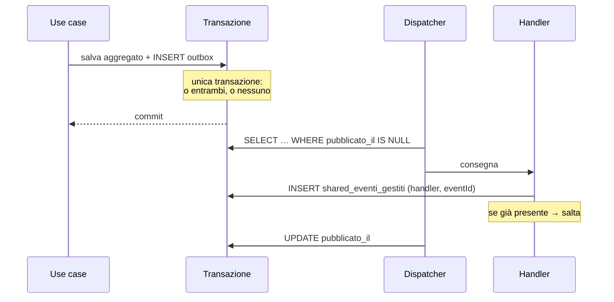

# 4. Architettura

Quarto e ultimo documento. Chiude ogni debito tecnico dichiarato dai tre precedenti: contratti
di comandi ed eventi, eccezioni, read model, rotte, persistenza, propagazione, guardiani e
test.

Niente qui introduce nuove decisioni di dominio. Se una regola compare in questo documento e
non nei precedenti, è un errore di stratificazione, non una scoperta.

---

## 4.1 Struttura

| Ambito | Scelta |
|---|---|
| Monorepo | Turborepo + pnpm |
| Backend | NestJS (TypeScript) in `apps/api` — un solo progetto, moduli per contesto |
| Frontend | React, **due app**: `apps/web-dipendente`, `apps/web-formazione` |
| Identità | Nessuna autenticazione: header `X-Utente`, letto in un solo punto |
| Persistenza | SQL **state-based** con Drizzle ORM — SQLite in sviluppo, schema portabile su Postgres |
| Eventi fra moduli | Event bus in-process, handler asincroni, tabella **outbox** |
| Deploy | Monolite modulare, un processo, un database |

**Perché state-based e non Event Sourcing.** Sarebbe tematicamente affine: abbiamo fatto un
event storming, gli eventi ci sono già. Ma introdurrebbe un secondo corpo di concetti —
stream, proiezioni, snapshot, versionamento, replay — che diventerebbe *il* protagonista,
oscurando quello vero: aggregati, invarianti e confini. Gli eventi restano centrali come modo
in cui i contesti si parlano; semplicemente non sono anche il meccanismo di persistenza.

Cartelle per **contesto prima che per strato**. Aprire `iscrizioni/` deve mostrare il dominio,
non la tecnologia.

```
apps/api/src/
├── iscrizioni/                       🔴 Core
│   ├── domain/
│   │   ├── sessione.ts                    aggregato — INV-4,5,6,7,8,9,10,12
│   │   ├── iscrizione.ts                  entità interna
│   │   ├── value-objects/                 SessioneId, Capienza, Luogo, Docente, …
│   │   ├── eventi.ts                      eventi di dominio + NOMI_EVENTI_ISCRIZIONI
│   │   ├── errori.ts                      eccezioni di dominio
│   │   └── porte/                         RepositorySessioni, CorsiPubblicati
│   ├── application/
│   │   ├── programma-sessione.use-case.ts
│   │   ├── iscriviti.use-case.ts
│   │   ├── annulla-iscrizione.use-case.ts
│   │   ├── modifica-capienza.use-case.ts
│   │   ├── annulla-sessione.use-case.ts
│   │   ├── policy/annulla-sessioni-corso-ritirato.policy.ts       P2
│   │   └── con-riprova.ts                 retry sul conflitto di versione
│   ├── infrastructure/
│   │   ├── persistence/                   schema Drizzle, mapper, repository, in-memory
│   │   ├── acl/                           traduzione eventi catalogo → replica locale
│   │   └── http/                          controller, DTO
│   └── read-model/                        query di lettura
├── catalogo/                         🟡 Supporting — stessa struttura
├── notifiche/                        ⚪ Generic — composizione messaggio + adapter di log
└── shared/
    ├── domain/                       DataLocale, OraLocale, IstanteLocale, Orologio, GeneratoreDiId
    ├── event-bus/
    ├── outbox/
    ├── persistence/                  tipi colonna, unità di lavoro
    └── http/                         filtro eccezioni → stato HTTP, UtenteCorrente da X-Utente
```

**Il numero di app frontend è invisibile qui dentro.** I moduli sono `iscrizioni`, `catalogo`,
`notifiche` — i bounded context di `domain.md` §2.2 — e non `dipendente` e `formazione`. Un
backend organizzato per app frontend trasforma il modulo in un raccoglitore di endpoint per
schermata, e i confini di contesto evaporano: sarebbe l'unico modo di sprecare tutto il lavoro
del secondo documento senza accorgersene.

### Le primitive temporali, una volta per tutte

Vivono in `shared/domain` perché entrambi i contesti le usano, e sono l'unico modo in cui il
tempo entra nel dominio.

| Tipo | Forma | Operazioni |
|---|---|---|
| `DataLocale` | `YYYY-MM-DD` | `precede`, `confronta` |
| `OraLocale` | `HH:MM` | `precede`, `confronta` |
| `IstanteLocale` | `DataLocale` + `OraLocale` | `precede`, `menoOre(n)`, `confronta` |

Nessuna delle tre usa `Date`. Sono stringhe validate con aritmetica esplicita: nessun fuso
orario può rientrare da una porta di servizio, e il confronto lessicografico coincide con
quello cronologico.

---

## 4.2 Contratti dei comandi

*Debito di `event-storming.md` §1.10.* Gli oggetti comando dell'application layer, in italiano.
Il DTO HTTP che li alimenta è in inglese ed è in §4.6; la traduzione avviene nel controller e
in nessun altro punto.

### Catalogo

```ts
CreaCorso              { titolo: string, descrizione: string, durataInOre: number, argomento: string }
ModificaDettagliCorso  { corsoId: string, titolo: string, descrizione: string, durataInOre: number, argomento: string }
PubblicaCorso          { corsoId: string }
RitiraCorso            { corsoId: string }
```

### Iscrizioni

```ts
ProgrammaSessione      { corsoId: string, data: 'YYYY-MM-DD', oraInizio: 'HH:MM',
                         luogo: { tipo: 'AULA', nome: string } | { tipo: 'ONLINE' },
                         docente: string, capienza: number }
ModificaCapienzaSessione { sessioneId: string, capienza: number }
AnnullaSessione        { sessioneId: string, motivo: 'DECISIONE_RESPONSABILE' | 'CORSO_RITIRATO' }
Iscriviti              { sessioneId: string, dipendenteId: string, email: string }
AnnullaIscrizione      { sessioneId: string, dipendenteId: string }
```

**Due assenze deliberate.** In `Iscriviti` e `AnnullaIscrizione` il `dipendenteId` **non arriva
mai dal corpo della richiesta**: lo inietta il controller dall'`UtenteCorrente`. È la metà HTTP
della difesa di INV-9 decisa in `aggregation.md` §3.9. E in nessun comando compare un istante:
il tempo arriva dalla porta `Orologio`, mai dal chiamante — altrimenti la regola delle 24 ore
sarebbe aggirabile con un campo.

### Vincoli, e dove vivono

Ogni vincolo è verificato **due volte**, in due punti con due scopi diversi.

| Vincolo | `class-validator` (DTO) → 400 | Value object → eccezione di dominio |
|---|---|---|
| titolo non vuoto, ≤ 200 | `@IsString() @Length(1,200)` | `TitoloCorso` |
| durata intera 1…200 | `@IsInt() @Min(1) @Max(200)` | `DurataInOre` |
| capienza intera ≥ 1 | `@IsInt() @Min(1)` | `Capienza` (INV-3) |
| data `YYYY-MM-DD` | `@Matches(/^\d{4}-\d{2}-\d{2}$/)` | `DataLocale` |
| ora `HH:MM` | `@Matches(/^\d{2}:\d{2}$/)` | `OraLocale` |
| email ben formata | `@IsEmail()` | `Email` |

Non è ridondanza. «Questa richiesta HTTP è ben formata?» e «questo valore può esistere nel mio
dominio?» sono domande distinte: la prima è rilevante solo per un client HTTP, la seconda vale
anche quando il comando nasce da una policy o da un test. Cancellare la `ValidationPipe` deve
lasciare il dominio altrettanto sicuro, solo con messaggi peggiori.

---

## 4.3 Contratti degli eventi

*Debito di `event-storming.md` §1.10 e `domain.md` §2.10.*

**Nome sul bus**: `<contesto>.<Evento>.v<versione>`. La versione nel nome rende il
versionamento un'operazione additiva — si pubblica `.v2` accanto a `.v1` finché tutti i
sottoscrittori sono migrati — e rende verificabile il contratto ACL (§4.9).

Ogni evento porta una **busta** comune:

```ts
{ eventId: string, nome: string, occorsoIl: string /* ISO locale */, aggregateId: string, payload: … }
```

### Catalogo

| Nome sul bus | Payload |
|---|---|
| `catalogo.CorsoCreato.v1` | `{ corsoId, titolo, argomento, durataInOre }` |
| `catalogo.DettagliCorsoModificati.v1` | `{ corsoId, titolo, argomento, durataInOre }` |
| `catalogo.CorsoPubblicato.v1` | `{ corsoId, titolo }` |
| `catalogo.CorsoRitirato.v1` | `{ corsoId }` |

### Iscrizioni

| Nome sul bus | Payload |
|---|---|
| `iscrizioni.SessioneProgrammata.v1` | `{ sessioneId, corsoId, titoloCorso, data, oraInizio, luogo, docente, capienza }` |
| `iscrizioni.CapienzaSessioneModificata.v1` | `{ sessioneId, capienzaPrecedente, capienza }` |
| `iscrizioni.SessioneAnnullata.v1` | `{ sessioneId, titoloCorso, data, oraInizio, motivo, destinatari: [{ dipendenteId, email, stato }] }` |
| `iscrizioni.DipendenteIscritto.v1` | `{ sessioneId, dipendenteId, email }` |
| `iscrizioni.DipendenteMessoInAttesa.v1` | `{ sessioneId, dipendenteId, email, posizione }` |
| `iscrizioni.IscrizioneAnnullata.v1` | `{ sessioneId, dipendenteId }` |
| `iscrizioni.AttesaAnnullata.v1` | `{ sessioneId, dipendenteId }` |
| `iscrizioni.DipendentePromosso.v1` | `{ sessioneId, titoloCorso, data, oraInizio, dipendenteId, email }` |

Due payload meritano una nota, e in entrambi i casi la ragione è la stessa.

**`SessioneAnnullata` porta l'elenco completo dei destinatari** — decisione HS-10,
`domain.md` §2.8. Se non lo facesse, il contesto notifiche dovrebbe interrogare `iscrizioni`
*dopo* l'annullamento per sapere a chi scrivere, cioè leggere lo stato del core dall'esterno nel
momento peggiore.

**`DipendentePromosso` porta titolo, data e ora** oltre all'indirizzo. Sono ridondanti rispetto
a `sessioneId`, ed è voluto: senza di essi la notifica sarebbe costretta a una query per
scrivere «sei passato da lista d'attesa a iscritto per *Kubernetes base*, martedì 12 alle
09:00». Un evento è autosufficiente o non è un evento.

---

## 4.4 Eccezioni di dominio → stati HTTP

*Debito di tutti e tre i documenti precedenti.* I rifiuti sono eccezioni, non eventi. La
traduzione vive in un **filtro nello strato infrastrutturale**: nessuna classe di `domain/` sa
cosa sia un 409.

### Il criterio, prima della tabella

Perché 409 e 422 non finiscano assegnati a intuito:

- **409 Conflict** — lo **stato dell'aggregato** rifiuta un comando che in un altro momento
  sarebbe stato valido, o che è già stato eseguito. Il client può riconciliarsi rileggendo.
- **422 Unprocessable Entity** — una **regola di business** rifiuta i dati o il momento della
  richiesta, e rileggere non cambia nulla. Include tutto ciò che dipende dal trascorrere del
  tempo, perché il tempo non torna indietro.

| Eccezione | Contesto | Stato | Quando |
|---|---|---|---|
| `CorsoNonTrovato` | catalogo | **404** | Identificativo inesistente |
| `TitoloCorsoGiaUsato` | catalogo | **409** | INV-1 (HS-7) |
| `TransizioneCorsoNonAmmessa` | catalogo | **409** | Pubblicare ciò che non è in bozza, ritirare ciò che non è pubblicato |
| `CorsoRitiratoNonModificabile` | catalogo | **409** | HS-12 |
| `SessioneNonTrovata` | iscrizioni | **404** | Identificativo inesistente |
| `IscrizioneNonTrovata` | iscrizioni | **404** | INV-9: annullare ciò che non è proprio |
| `IscrizioneDuplicata` | iscrizioni | **409** | INV-5 |
| `SessioneGiaAnnullata` | iscrizioni | **409** | INV-12 |
| `SessioneAnnullataNonIscrivibile` | iscrizioni | **409** | INV-6 |
| `CorsoNonPubblicato` | iscrizioni | **422** | INV-2 |
| `CapienzaNonValida` | iscrizioni | **422** | INV-3 |
| `CapienzaInferioreAgliIscritti` | iscrizioni | **422** | HS-2 |
| `SessioneNelPassato` | iscrizioni | **422** | Programmare a data trascorsa |
| `SessioneGiaIniziata` | iscrizioni | **422** | INV-6, dipende dal tempo |
| `AnnullamentoFuoriTermine` | iscrizioni | **422** | INV-10, dipende dal tempo |
| *(nessuna — `ValidationPipe`)* | http | **400** | Richiesta malformata, mai dal dominio |
| `ConflittoDiVersioneNonRisolto` | shared | **503** + `Retry-After: 1` | Contesa non risolta dopo i retry (§4.7) |

Corpo della risposta, uniforme:

```json
{ "error": "AnnullamentoFuoriTermine", "message": "…", "status": 422 }
```

Il nome dell'eccezione è in italiano perché è **linguaggio ubiquo**, e trapela deliberatamente
nel campo `error`: è ciò che permette al frontend di distinguere i casi senza interpretare la
prosa. Rotte e campi restano inglesi.

Che ogni eccezione compaia in questa tabella non è affidato alla memoria: c'è un test di
contratto (§4.9) che fallisce se una classe di errore non ha uno stato dichiarato.

---

## 4.5 Read model

*Debito di `event-storming.md` §1.6.* Due letture, come previsto.

**Sono query SQL dedicate sulle tabelle di stato del modulo, non proiezioni materializzate.**
La persistenza è state-based: una proiezione separata aggiungerebbe una consistenza eventuale
*dentro l'interfaccia utente* — un posto che risulta libero perché la proiezione è indietro —
in cambio di nulla, dato che le query sono su decine di righe. Ciò che invece resta fermo è che
le query **non passano dai repository degli aggregati** e non restituiscono oggetti di dominio:
è la difesa contro il repository onnisciente.

### R1 — Sessioni aperte, con posti residui

```sql
SELECT s.id, s.corso_id, s.corso_titolo, s.data, s.ora_inizio,
       s.luogo_tipo, s.luogo_nome, s.docente, s.capienza,
       COUNT(CASE WHEN i.stato = 'ISCRITTO'  THEN 1 END) AS iscritti,
       COUNT(CASE WHEN i.stato = 'IN_ATTESA' THEN 1 END) AS in_attesa
  FROM iscrizioni_sessioni s
  LEFT JOIN iscrizioni_iscrizioni i ON i.sessione_id = s.id
 WHERE s.stato = 'PROGRAMMATA'
   AND (s.data > :oggi OR (s.data = :oggi AND s.ora_inizio > :adesso))
 GROUP BY s.id
 ORDER BY s.data, s.ora_inizio;
```

`posti_residui = capienza − iscritti`, calcolato nel DTO. `:oggi` e `:adesso` arrivano
dall'`Orologio`, anche qui: la lettura non ha invarianti da difendere, ma un `date('now')`
in SQL reintrodurrebbe sia il fuso orario sia il non determinismo nei test.

> Questo numero **si mostra e non si usa per decidere**. Chi decide se il posto c'è è la
> `Sessione`, con l'aggregato caricato per intero e il lock ottimistico. Contare i posti qui per
> poi iscrivere è l'anti-pattern che fa prendere a due dipendenti lo stesso ultimo posto.

### R2 — Le mie iscrizioni

```sql
SELECT s.id AS sessione_id, s.corso_titolo, s.data, s.ora_inizio,
       s.luogo_tipo, s.luogo_nome, s.docente, s.stato AS stato_sessione,
       s.motivo_annullamento, i.stato AS stato_iscrizione, i.ordine
  FROM iscrizioni_iscrizioni i
  JOIN iscrizioni_sessioni s ON s.id = i.sessione_id
 WHERE i.dipendente_id = :dipendenteId
 ORDER BY s.data DESC, s.ora_inizio DESC;
```

Il DTO deriva due informazioni che non stanno in nessuna colonna:

- `annullabileFinoA = inizio − 24h`, e `annullabile = adesso < annullabileFinoA` (INV-10);
- `decaduta = stato_iscrizione = 'IN_ATTESA' AND inizio ≤ adesso` — la traduzione di HS-9,
  che `aggregation.md` §3.8 ha assegnato esattamente a questo punto.

`annullabile` è un **suggerimento per l'interfaccia**, non un permesso: il rifiuto vero arriva
dall'aggregato. Vale la stessa avvertenza dei posti residui.

### R3 — Catalogo corsi (responsabile)

Elenco piatto di `catalogo_corsi` con stato e conteggio delle sessioni programmate — che è una
lettura del modulo `iscrizioni`, quindi **due query separate composte nel frontend**, non una
join fra moduli. Il divieto 2 vale anche in lettura: una join fra `catalogo_corsi` e
`iscrizioni_sessioni` sarebbe la foreign key che non abbiamo dichiarato, scritta in SQL.

---

## 4.6 Rotte e DTO

Dominio in italiano, rotte e DTO in inglese, traduzione **solo nei controller**. Prefisso
`/api`.

| Metodo | Rotta | App che la consuma | Comando / lettura |
|---|---|---|---|
| `POST` | `/api/courses` | `web-formazione` | `CreaCorso` |
| `PATCH` | `/api/courses/:id` | `web-formazione` | `ModificaDettagliCorso` |
| `POST` | `/api/courses/:id/publish` | `web-formazione` | `PubblicaCorso` |
| `POST` | `/api/courses/:id/withdraw` | `web-formazione` | `RitiraCorso` |
| `GET` | `/api/courses` | `web-formazione` | R3 |
| `POST` | `/api/sessions` | `web-formazione` | `ProgrammaSessione` |
| `PATCH` | `/api/sessions/:id/capacity` | `web-formazione` | `ModificaCapienzaSessione` |
| `POST` | `/api/sessions/:id/cancel` | `web-formazione` | `AnnullaSessione` |
| `GET` | `/api/sessions/open` | `web-dipendente` | R1 |
| `POST` | `/api/sessions/:id/enrollments` | `web-dipendente` | `Iscriviti` |
| `DELETE` | `/api/sessions/:id/enrollments/me` | `web-dipendente` | `AnnullaIscrizione` |
| `GET` | `/api/enrollments/me` | `web-dipendente` | R2 |

La colonna di destra è **indicativa e non applicata**: non esiste autorizzazione, e nulla
impedisce a un'app di chiamare le rotte dell'altra. Serve a leggere la tabella, non a proteggerla.

Nessun prefisso di ruolo — niente `/api/admin/...`. Le rotte restano organizzate per risorsa: un
prefisso che nomina chi chiama codifica nell'URL un'informazione che non riguarda la risorsa, e
al primo attore nuovo costringerebbe a duplicare rotte identiche.

Rotte deliberatamente **non CRUD** dove il dominio non è CRUD: `publish`, `withdraw`, `cancel`
sono transizioni con un nome, non `PATCH { "state": "…" }`. Un `PATCH` sullo stato inviterebbe
il client a proporre la transizione successiva, che è una decisione dell'aggregato.

E `POST /api/sessions/:id/enrollments` **non ha un corpo con l'identificativo del dipendente**,
mentre `DELETE …/enrollments/me` ha `me` al posto di un parametro: INV-9 non è manomettibile
perché non c'è nulla da manomettere (`aggregation.md` §3.9).

### Il DTO di iscrizione ha due esiti, non uno

```ts
// 201 Created
{ "status": "ENROLLED" }
{ "status": "WAITLISTED", "position": 3 }
```

Un solo `201` con un discriminante, perché entrambi sono successi. Restituire `409` per la lista
d'attesa sarebbe la traduzione HTTP dell'errore che il dominio ha evitato: a posti esauriti non
si viene respinti.

### Chi sta chiamando

Non c'è autenticazione né autorizzazione. Resta solo l'identificazione, perché INV-9 ne ha
bisogno: header `X-Utente: email`, tradotto in `UtenteCorrente { id, email }` da un provider in
`shared/http` e iniettato nei controller con un decoratore. Nessuna guard, nessun ruolo, nessun
403.

`id` è derivato dall'email in modo **deterministico** — UUID v5 su un namespace fisso — così
resta stabile fra i riavvii senza alcuna tabella utenti. È anche il motivo per cui non serve un
contesto `identity`: senza ruoli da verificare e senza anagrafica da consultare, non resta un
modello, resta una riga di parsing.

Il confine da tenere è comunque quello: `X-Utente` è letto **in un solo punto**. Il giorno che
diventasse un SSO vero, a cambiare sarebbe quel file e nient'altro — nessun controller, nessun
use case e ovviamente nessun aggregato sa da dove arriva l'identità.

---

## 4.7 Persistenza

Drizzle ORM, SQLite in sviluppo, schema portabile su Postgres. Tabelle **prefissate per
modulo**: il prefisso dichiara il proprietario.

```
catalogo_corsi              (id, titolo, titolo_normalizzato UNIQUE, descrizione,
                             durata_ore, argomento, stato, versione)

iscrizioni_sessioni         (id, corso_id, corso_titolo, data, ora_inizio,
                             luogo_tipo, luogo_nome, docente, capienza,
                             stato, motivo_annullamento, versione)

iscrizioni_iscrizioni       (sessione_id, dipendente_id, email, stato, ordine,
                             PRIMARY KEY (sessione_id, dipendente_id),
                             FOREIGN KEY (sessione_id) → iscrizioni_sessioni.id)

iscrizioni_corsi_pubblicati (corso_id PK, titolo, pubblicato, aggiornato_il)   ← replica ACL

shared_outbox               (id PK, nome_evento, payload, occorso_il,
                             pubblicato_il NULL, tentativi)

shared_eventi_gestiti       (handler, evento_id, PRIMARY KEY (handler, evento_id))

notifiche_messaggi          (id PK, destinatario, oggetto, corpo, inviato_il)
```

**L'unica foreign key del sistema è interna a `iscrizioni`**, fra la sessione e le sue
iscrizioni — stesso aggregato, stesso proprietario, ed è corretta. Fra `iscrizioni_sessioni.corso_id`
e `catalogo_corsi.id` **non c'è**, e non è una dimenticanza: è la decisione di `domain.md` §2.9.
Quel valore è una copia, e il database non deve poter garantire un'integrità a cui il modello ha
rinunciato.

### Tipi colonna, isolati

Date e ore sono **colonne testuali** `YYYY-MM-DD` e `HH:MM:SS`, mai timestamp numerici: un
intero in millisecondi reintrodurrebbe il fuso orario che il modello ha escluso, e i due formati
sono lessicograficamente ordinabili — la clausola `ORDER BY s.data, s.ora_inizio` di R1 funziona
per costruzione. Tutti i tipi colonna vivono in `shared/persistence/tipi.ts`, così il porting a
Postgres è un'operazione locale a un file.

### Mapper espliciti

L'aggregato si carica e si salva **per intero**, con un mapper scritto a mano fra dominio e
righe. `Sessione` è sempre letta con tutte le sue iscrizioni: senza di esse non può difendere
INV-4, e un caricamento parziale sarebbe un aggregato che decide alla cieca.

È lavoro in più ed è deliberato. Appena si mette `@Entity` su un aggregato, è l'ORM a dettare la
forma del modello: `Iscrizione.ordine` diventa un `@Column`, il costruttore privato diventa
pubblico perché l'ORM ne ha bisogno, e la classe smette di poter garantire i propri invarianti
alla costruzione.

### Lock ottimistico e riprova

Ogni aggregato ha una colonna `versione`. Il salvataggio è:

```sql
UPDATE iscrizioni_sessioni SET …, versione = :versioneLetta + 1
 WHERE id = :id AND versione = :versioneLetta;
```

Zero righe aggiornate significa che qualcun altro ha scritto: il repository solleva
`ConflittoDiVersione`. Le iscrizioni figlie si riscrivono nella stessa transazione.

**La riprova vive nell'application service, non nel dominio** — `con-riprova.ts`, 3 tentativi,
attesa 0/10/25 ms. Ricarica l'aggregato ed esegue di nuovo il comando. Al secondo tentativo
l'iscrizione dell'altro è visibile e la normale regola dei posti produce l'esito giusto: il
rifiuto per duplicato, oppure l'ingresso in lista d'attesa. Non esiste un ramo di codice per
«ho perso la gara»: c'è solo la regola di dominio applicata a uno stato aggiornato.

Esaurite le riprove: `ConflittoDiVersioneNonRisolto` → **503** con `Retry-After: 1`. È un
fallimento tecnico ritentabile, e va distinto da un rifiuto di dominio — che è definitivo.

---

## 4.8 Propagazione degli eventi

Handler **asincroni** con tabella **outbox**.



L'evento si scrive nella **stessa transazione** che salva l'aggregato: stato ed evento
diventano atomici. L'alternativa semplice — emettere dopo il commit — funziona il 99% delle
volte e perde eventi nell'1% restante, che nel nostro caso significa un promosso mai avvisato.

La consegna è **at-least-once**, quindi ogni handler è **idempotente** tramite il registro
`(handler, eventId)`. Il dispatcher gira in-process: polling breve, più un risveglio immediato
dopo ogni commit.

### Gli handler, e l'ordine che conta

| Handler | Ascolta | Fa |
|---|---|---|
| `AclCatalogo` | `CorsoPubblicato`, `CorsoRitirato`, `DettagliCorsoModificati` | Aggiorna `iscrizioni_corsi_pubblicati` (P5) |
| `AnnullaSessioniCorsoRitirato` | `CorsoRitirato` | Per ogni sessione **futura** del corso: `AnnullaSessione(CORSO_RITIRATO)` (P2, INV-11) |
| `NotificaPromozione` | `DipendentePromosso` | Compone e «invia» (P3) |
| `NotificaSessioneAnnullata` | `SessioneAnnullata` | Un messaggio per ciascun destinatario dell'evento (P4) |

**Su `CorsoRitirato` l'ordine è vincolante**: prima `AclCatalogo`, poi
`AnnullaSessioniCorsoRitirato`. È la condizione perché la finestra di inconsistenza di HS-8
resti auto-riparante — se le sessioni si annullassero prima dell'aggiornamento della replica,
una sessione programmata nella finestra sopravvivrebbe al ritiro. È il tipo di dipendenza che
si dimentica in sei mesi: merita un commento nel codice che rimandi a `domain.md` §2.7.

`AnnullaSessioniCorsoRitirato` chiama il caso d'uso, **non** manipola le sessioni: itera su
`futureDelCorso(corsoId, adesso)` e ignora `SessioneGiaAnnullata`, che sotto at-least-once è
l'esito normale di una riconsegna e non un problema.

---

## 4.9 I guardiani automatici

Le discipline non restano buone intenzioni.

### ESLint — la regola della dipendenza

```js
// eslint.config.js (flat config) — estratto
{
  files: ['apps/api/src/**/domain/**/*.ts'],
  ignores: ['**/*.spec.ts'],
  rules: {
    'no-restricted-imports': ['error', { patterns: [
      { group: ['@nestjs/*', 'drizzle-orm', 'drizzle-orm/*', 'better-sqlite3',
                'class-validator', 'class-transformer'],
        message: 'Il dominio non conosce il framework. Definisci una porta.' },
      { group: ['**/application/**', '**/infrastructure/**', '**/read-model/**'],
        message: 'La dipendenza punta verso l\'interno: domain non importa dagli strati esterni.' },
    ]}],
    'no-restricted-syntax': ['error',
      { selector: "NewExpression[callee.name='Date']",
        message: 'Niente orologio nel dominio: l\'istante corrente arriva dalla porta Orologio.' },
      { selector: "MemberExpression[object.name='Date'][property.name='now']",
        message: 'Idem: usa la porta Orologio.' },
      { selector: "MemberExpression[object.name='Math'][property.name='random']",
        message: 'Il dominio è deterministico: usa GeneratoreDiId.' },
    ],
  },
},
```

Il divieto di `new Date()` si estende con la stessa configurazione a `**/application/**`.

### ESLint — i due divieti fra contesti

```js
{
  files: ['apps/api/src/iscrizioni/**/*.ts'],
  ignores: ['**/*.spec.ts'],
  rules: { 'no-restricted-imports': ['error', { patterns: [
    { group: ['**/catalogo/**', 'src/catalogo/*'],
      message: 'Bounded context: se serve un dato dal catalogo, arriva per evento e passa dall\'ACL.' },
  ]}]},
},
{
  files: ['apps/api/src/catalogo/**/*.ts'],
  ignores: ['**/*.spec.ts'],
  rules: { 'no-restricted-imports': ['error', { patterns: [
    { group: ['**/iscrizioni/**', 'src/iscrizioni/*'],
      message: 'Bounded context: il catalogo non sa di avere clienti.' },
  ]}]},
},
```

**I file di test sono esentati**, ed è una scelta e non una scorciatoia: osservano il sistema da
fuori, ed è esattamente così che si verifica che i due lati di un contratto coincidano — cosa
che i due test seguenti fanno importando entrambi i lati.

### Test di contratto 1 — ogni errore ha uno stato HTTP

Il filtro possiede un registro `Map<classe, stato>`. Il test scandisce i file
`**/domain/**/errori.ts`, estrae ogni classe che estende `ErroreDiDominio`, e **fallisce se una
non è nel registro**. Aggiungere un'eccezione senza decidere come si presenta al client diventa
impossibile. La scansione dei file — invece di un elenco importato — è deliberata: un barrel si
dimentica di aggiornare, una cartella no.

### Test di contratto 2 — l'ACL parla la stessa lingua del catalogo

`catalogo/domain/eventi.ts` esporta `NOMI_EVENTI_CATALOGO`; l'ACL di iscrizioni ridichiara le
proprie costanti in `iscrizioni/infrastructure/acl/eventi-catalogo.ts`, perché non può importarle
(divieto 1). Il test — esente dal divieto — importa **entrambi** e verifica che i nomi
coincidano, e che l'ACL sappia tradurre un payload d'esempio prodotto dal catalogo.

È il test che dà valore alla duplicazione: la ridichiarazione è il costo del confine, e questo
test è ciò che impedisce al costo di diventare un difetto silenzioso.

---

## 4.10 Test

Piramide **rovesciata** rispetto all'abitudine.

### 1. Dominio — la maggioranza, in millisecondi

Nessuna infrastruttura: si istanzia un aggregato, si invoca un metodo, si verifica l'esito.
`Orologio` è una costante, `GeneratoreDiId` un contatore.

Uno per invariante, scritti per primi e leggibili da un non programmatore:

| Test | Invariante |
|---|---|
| il posto numero *capienza+1* finisce in lista d'attesa, non viene respinto | INV-4, INV-8 |
| chi annulla libera il posto per il **primo** in attesa, non per un altro | INV-7, INV-8 |
| tre in coda, uno annulla: promosso il primo, gli altri scalano | INV-7 |
| nessuno si iscrive due volte alla stessa sessione | INV-5 |
| non si annulla l'iscrizione di un altro | INV-9 |
| a 25 ore dall'inizio l'annullamento passa, a 23 no | INV-10 |
| non ci si iscrive a una sessione annullata | INV-6, INV-12 |
| non ci si iscrive a una sessione già iniziata | INV-6 |
| una sessione non si programma con capienza 0 | INV-3 |
| ridurre la capienza sotto gli iscritti è rifiutato | HS-2 |
| aumentare la capienza di 2 promuove i primi 2 in coda | HS-14, INV-8 |
| chi era in attesa e si sfila non promuove nessuno | INV-8 |
| annullare una sessione già annullata è rifiutato | INV-12 |

Che tutto questo si verifichi **senza database, senza HTTP e senza NestJS** è l'intero punto
dell'esercizio: se per verificare «il posto va al primo in attesa» servisse avviare un database,
il modello non starebbe dove crediamo.

### 2. Use case — con repository in-memory

Orchestrazione ed eventi prodotti: che `annullaIscrizione` scriva `IscrizioneAnnullata` **e**
`DipendentePromosso` in outbox, che `ProgrammaSessione` rifiuti un corso assente dalla replica
(INV-2), che la policy P2 annulli solo le sessioni future (INV-11).

### 3. Integrazione — pochi, e questi sì con il database

| Test | Perché serve un database vero |
|---|---|
| **due iscrizioni concorrenti sull'ultimo posto** | È il punto in cui l'esercizio ha davvero contesa: uno iscritto, l'altro in lista d'attesa, mai due sullo stesso posto |
| due corsi con lo stesso titolo in concorrenza | INV-1 è custodita dal vincolo `UNIQUE` (HS-7): è l'unica invariante non verificabile nel dominio |
| mapping e round-trip dell'aggregato | Che `Sessione` salvata e riletta sia identica, ordine della coda compreso |
| outbox atomico | Che un fallimento dopo il salvataggio non lasci l'evento senza lo stato, né viceversa |
| idempotenza degli handler | Consegnare due volte lo stesso evento produce una notifica sola |

### 4. End-to-end — pochissimi

Un percorso completo via HTTP: pubblica corso → programma sessione da 1 posto → A si iscrive →
B va in coda → A annulla → B risulta iscritto e la notifica compare nel log.

---

## 4.11 Frontend — due app

**Un'app per attore**, e gli attori con comandi sono due: il Dipendente e il Responsabile
formazione (`event-storming.md` §1.4). Il terzo attore è il Sistema, che non ha interfaccia per
definizione. Il docente non compare: è un value object, non formula comandi (`domain.md` §2.6).

| App | Attore | Contesti che consuma | Viste |
|---|---|---|---|
| `web-dipendente` | Dipendente | solo `iscrizioni` | Sessioni aperte con posti residui · Le mie iscrizioni |
| `web-formazione` | Responsabile | `catalogo` **e** `iscrizioni` | Catalogo corsi · Programmazione sessioni |

| Vista | App | Consuma |
|---|---|---|
| Sessioni aperte, con posti residui | `web-dipendente` | `GET /api/sessions/open`, `POST …/enrollments` |
| Le mie iscrizioni, con annullamento | `web-dipendente` | `GET /api/enrollments/me`, `DELETE …/enrollments/me` |
| Gestione catalogo corsi | `web-formazione` | `GET/POST/PATCH /api/courses`, `publish`, `withdraw` |
| Programmazione e annullamento sessioni | `web-formazione` | `POST /api/sessions`, `cancel`, `capacity` |
| Selettore utente | entrambe, da `packages/dev-identity` | Imposta l'header `X-Utente` |

### Perché due app, e non una con due sezioni

Perché rende visibile una cosa che a parole non si crede: **le app non coincidono con i
contesti**. `web-dipendente` ne consuma uno, `web-formazione` ne attraversa due — ed è corretto
così. Il bounded context è un confine di modello e di transazione, non di schermata.

La prova sta in R3 (§4.5), dichiarato come *due query separate composte nel frontend, mai una
join*. Con due app quella riga smette di essere una regola astratta: la schermata che compone i
due contesti è fisicamente altrove rispetto a quelle che ne usano uno solo.

### Cosa condividono, e cosa no

```
packages/
├── contracts/       DTO e tipi delle rotte, in inglese — nessun tipo di dominio
├── api-client/      fetch tipizzato su contracts, errore HTTP → eccezione
├── ui/              Button, Table, Badge, Form — ignoranti di dominio
└── dev-identity/    selettore utente, imposta X-Utente
```

`contracts` è il punto in cui la traduzione italiano → inglese è **già avvenuta**: il frontend
vede `Session`, mai `Sessione`. Vale una regola `no-restricted-imports` che vieti alle app di
importare da `apps/api/src/*/domain`, nella stessa forma dei guardiani di §4.9 — senza, il primo
`import type { Sessione }` scritto per comodità promuove l'aggregato a contratto pubblico.

In `ui` solo ciò che non sa di dominio. La tentazione sarà mettervi `CardSessione`, perché
entrambe le app mostrano sessioni: ma il dipendente vede i posti residui e un bottone
«Iscriviti», il responsabile vede il numero di iscritti e un bottone «Annulla». Un componente
condiviso diventerebbe in due settimane un albero di `if` sull'attore — cioè il ruolo
reintrodotto nel codice comune, che è esattamente ciò che dividere le app doveva evitare.
Somiglianza non è riuso: si duplica, e si condivide quando le due copie sono rimaste identiche
abbastanza a lungo.

Il bottone «Iscriviti» in particolare **non va mai in `ui`**: deve restare abilitato anche a
zero posti residui, e in un componente condiviso qualcuno prima o poi aggiungerà
`disabled={postiResidui === 0}` per gentilezza — facendo decidere al frontend quale dei due
esiti si verifica.

### Le regole valide per entrambe

Il frontend consuma **DTO**, mai oggetti di dominio: se si serializzasse un aggregato in HTTP,
la sua forma interna diventerebbe un contratto pubblico e non si potrebbe più cambiare senza
rompere il client. È il principio del mapper sull'ORM, applicato all'altro capo.

Due comportamenti dell'interfaccia discendono direttamente da decisioni di dominio, e vanno
implementati come tali:

- **L'esito dell'iscrizione si legge dalla risposta**, non si prevede. Il bottone dice
  «Iscriviti» anche a zero posti residui: sarà `status: WAITLISTED` a dire cosa è successo. Una
  UI che disabilita il bottone perché il read model dice «pieno» sta decidendo al posto
  dell'aggregato.
- **Il cambio sessione è una sequenza guidata** — prima iscriviti alla nuova, poi annulla la
  vecchia — perché non esiste un comando dedicato (HS-5, `aggregation.md` §3.6) e quest'ordine
  è quello che non fa perdere il posto.

---

## 4.12 Chiusura

### Ogni hotspot, e dove è deciso

| # | Hotspot | Decisione | Dove |
|---|---|---|---|
| HS-1 | Dove sta la sessione | In `iscrizioni`: custodisce ciò su cui decide | `domain.md` §2.5 |
| HS-2 | Capienza sotto gli iscritti | Si rifiuta, nessuna espulsione | `aggregation.md` §3.6 |
| HS-3 | Dove sta la coda | Dentro `Sessione`: una transazione sola | `aggregation.md` §3.6 |
| HS-4 | Promozione | Transazionale, non reattiva — INV-8 lo impone | `aggregation.md` §3.6 |
| HS-5 | Cambia sessione | Nessun comando dedicato; sequenza guidata nella UI | `aggregation.md` §3.6 |
| HS-6 | Docente | Value object, nessun terzo contesto | `domain.md` §2.6 |
| HS-7 | Titolo unico | Vincolo `UNIQUE` tradotto in eccezione di dominio | `aggregation.md` §3.7 |
| HS-8 | INV-2 fra contesti | Replica ACL, inconsistenza auto-riparante | `domain.md` §2.7 |
| HS-9 | Coda a sessione iniziata | Nessuna transizione: decadenza derivata nel read model | `aggregation.md` §3.8 |
| HS-10 | Indirizzo del destinatario | Viaggia dentro l'evento | `domain.md` §2.8 |
| HS-11 | Chi annulla cosa | Dominio **e** forma della rotta; nessuna autorizzazione nel sistema | `aggregation.md` §3.9 |
| HS-12 | Corso ripubblicato | `RITIRATO` è terminale | `aggregation.md` §3.8 |
| HS-13 | Modifica dettagli sessione | Solo la capienza; per il resto annulla e riprogramma | `aggregation.md` §3.8 |
| HS-14 | Capienza in aumento | Scorre la coda, nella stessa transazione | `aggregation.md` §3.6 |

### Ogni debito dichiarato, e dove è pagato

| Debito | Dichiarato in | Pagato in |
|---|---|---|
| Custode di ogni invariante | ES §1.8 | `aggregation.md` §3.5 |
| Sottodomini, contesti, context map | ES §1.10 | `domain.md` §2.1–2.4 |
| Aggregati, entità, value object | ES, DOM | `aggregation.md` §3.2–3.3 |
| Schema dati dei comandi | ES §1.10 | §4.2 |
| Payload e nomi degli eventi | ES §1.10, DOM §2.10 | §4.3 |
| Eccezioni di dominio → stati HTTP | ES §1.10 | §4.4 |
| Read model | ES §1.6, §1.10 | §4.5 |
| Rotte e DTO | AGG §3.11 | §4.6 |
| Schema di persistenza e mapper | ES, DOM, AGG | §4.7 |
| Lock ottimistico e riprova | AGG §3.11 | §4.7 |
| Outbox, idempotenza, ordine handler | DOM §2.10 | §4.8 |
| Guardiani ESLint e test di contratto | ES, DOM §2.9 | §4.9 |
| Test, uno per invariante | AGG §3.11 | §4.10 |

### Definizione di fatto

Lo stato al termine dei quattro documenti.

- [x] I quattro documenti esistono, e ogni hotspot dichiarato è chiuso con una decisione motivata
- [ ] Il backend implementa entrambi i contesti, event bus con outbox, read model, notifiche via log
- [ ] Le due app frontend consumano solo `packages/contracts`, mai i tipi di dominio
- [ ] `pnpm lint` passa con zero warning, guardiani architetturali inclusi
- [ ] Cancellando `infrastructure/`, il dominio compila ancora
- [ ] I test di dominio girano in meno di un secondo e si leggono come le regole di `event-storming.md` §1.0
- [ ] Le due app frontend coprono le quattro viste

Il criterio che ha arbitrato ogni scelta di questi quattro documenti resta quello di partenza, e
va riapplicato a ogni riga del codice che seguirà:

> Questa decisione rende **più visibile** il modello di dominio, o lo nasconde dietro
> l'infrastruttura?
