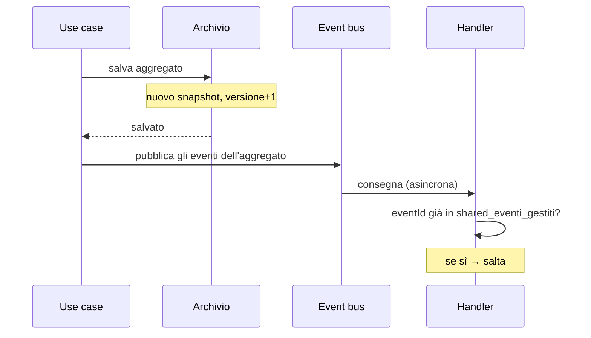

# 4. Architettura

Quarto e ultimo documento. Chiude ogni debito tecnico dichiarato dai tre precedenti: contratti
di comandi ed eventi, eccezioni, read model, rotte, persistenza, propagazione, guardiani e
test.

Niente qui introduce nuove decisioni di dominio. Se una regola compare in questo documento e
non nei precedenti, è un errore di stratificazione, non una scoperta.

---

## 4.1 Struttura

| Ambito | Scelta |
|---|---|
| Monorepo | Turborepo + pnpm |
| Backend | NestJS (TypeScript) in `apps/api` — un solo progetto, moduli per contesto |
| Frontend | React, **due app**: `apps/web-dipendente`, `apps/web-formazione` |
| Identità | Nessuna autenticazione: header `X-Utente`, letto in un solo punto |
| Persistenza | **State-based in memoria** — repository dietro porta, nessun database |
| Eventi fra moduli | Event bus in-process, handler asincroni e idempotenti |
| Deploy | Monolite modulare, un processo, stato che vive quanto il processo |

**Perché state-based e non Event Sourcing.** Sarebbe tematicamente affine: abbiamo fatto un
event storming, gli eventi ci sono già. Ma introdurrebbe un secondo corpo di concetti —
stream, proiezioni, snapshot, versionamento, replay — che diventerebbe *il* protagonista,
oscurando quello vero: aggregati, invarianti e confini. Gli eventi restano centrali come modo
in cui i contesti si parlano; semplicemente non sono anche il meccanismo di persistenza.

### Lo stato vive in memoria, non in un database

*Non è un hotspot del dominio — il committente non ha mai parlato di persistenza, e nessuna
invariante cambia. È una decisione di questo documento, con effetto su §4.5, §4.7, §4.8 e §4.10.*

Le porte esistevano già — `RepositorySessioni`, `RepositoryCorsi`, `CorsiPubblicati`
(`aggregation.md` §3.10) — e §4.10 dichiarava che verificare le invarianti «senza database,
senza HTTP e senza NestJS» è l'intero punto dell'esercizio. Il database serviva l'infrastruttura,
non il ragionamento: ne resta **una sola implementazione della porta**, in memoria.

| | In memoria (scelta) | SQL con Drizzle (scartata) |
|---|---|---|
| Invarianti di dominio | Identiche: INV-3…INV-12 non cambiano di una riga | Identiche |
| INV-1, titolo unico | Indice sul titolo normalizzato nel repository (§4.7) | Vincolo `UNIQUE`, HS-7 |
| Atomicità stato + evento | Non esiste transazione da cui difendersi: cade l'outbox (§4.8) | Outbox nella stessa transazione |
| Letture | Funzioni su collezioni (§4.5) | Query SQL dedicate |
| Costo di avvio | Nessuno: `pnpm dev` e basta | Migrazioni, schema, driver |

**Il prezzo, dichiarato.** Con una sola implementazione l'astrazione della porta non è più
*dimostrata*: che il dominio sia davvero indipendente dalla persistenza resta un'affermazione
finché nessuno scrive la seconda implementazione. È il debito che questa scelta apre, e va
tenuto scritto invece che dimenticato.

**Cosa lo farebbe cambiare idea.** Il primo requisito che chieda allo stato di sopravvivere al
riavvio del processo, o a un secondo processo di leggere gli stessi dati. Nessuno dei due è
oggi nei requisiti, ed entrambi si pagano con un modulo nuovo in `infrastructure/persistence/`
— non con una modifica al dominio. È esattamente ciò che le porte dovevano rendere possibile.

Cartelle per **contesto prima che per strato**. Aprire `iscrizioni/` deve mostrare il dominio,
non la tecnologia.

```
apps/api/src/
├── iscrizioni/                       🔴 Core
│   ├── domain/
│   │   ├── sessione.ts                    aggregato — INV-4,5,6,7,8,9,10,12
│   │   ├── iscrizione.ts                  entità interna
│   │   ├── value-objects/                 SessioneId, Capienza, Luogo, Docente, …
│   │   ├── eventi.ts                      eventi di dominio + NOMI_EVENTI_ISCRIZIONI
│   │   ├── errori.ts                      eccezioni di dominio
│   │   └── ports/                         RepositorySessioni, CorsiPubblicati
│   ├── application/
│   │   ├── programma-sessione.use-case.ts
│   │   ├── iscriviti.use-case.ts
│   │   ├── annulla-iscrizione.use-case.ts
│   │   ├── modifica-capienza.use-case.ts
│   │   ├── annulla-sessione.use-case.ts
│   │   ├── policy/annulla-sessioni-corso-ritirato.policy.ts       P2
│   │   └── con-riprova.ts                 retry sul conflitto di versione
│   ├── infrastructure/
│   │   ├── persistence/                   snapshot, mapper, repository in memoria
│   │   ├── acl/                           traduzione eventi catalogo → replica locale
│   │   └── http/                          controller, DTO
│   └── read-model/                        letture dedicate
├── catalogo/                         🟡 Supporting — stessa struttura
├── notifiche/                        ⚪ Generic — composizione messaggio + adapter di log
└── shared/
    ├── domain/                       DataLocale, OraLocale, IstanteLocale, Orologio, GeneratoreDiId
    ├── event-bus/                    bus in-process, registro degli eventi già gestiti
    ├── persistence/                  archivio in memoria, snapshot, controllo di versione
    └── http/                         filtro eccezioni → stato HTTP, UtenteCorrente da X-Utente
```

**Il numero di app frontend è invisibile qui dentro.** I moduli sono `iscrizioni`, `catalogo`,
`notifiche` — i bounded context di `domain.md` §2.2 — e non `dipendente` e `formazione`. Un
backend organizzato per app frontend trasforma il modulo in un raccoglitore di endpoint per
schermata, e i confini di contesto evaporano: sarebbe l'unico modo di sprecare tutto il lavoro
del secondo documento senza accorgersene.

### Le primitive temporali, una volta per tutte

Vivono in `shared/domain` perché entrambi i contesti le usano, e sono l'unico modo in cui il
tempo entra nel dominio.

| Tipo | Forma | Operazioni |
|---|---|---|
| `DataLocale` | `YYYY-MM-DD` | `precede`, `confronta` |
| `OraLocale` | `HH:MM` | `precede`, `confronta` |
| `IstanteLocale` | `DataLocale` + `OraLocale` | `precede`, `menoOre(n)`, `confronta` |

Nessuna delle tre usa `Date`. Sono stringhe validate con aritmetica esplicita: nessun fuso
orario può rientrare da una porta di servizio, e il confronto lessicografico coincide con
quello cronologico.

---

## 4.2 Contratti dei comandi

*Debito di `event-storming.md` §1.10.* Gli oggetti comando dell'application layer, in italiano.
Il DTO HTTP che li alimenta è in inglese ed è in §4.6; la traduzione avviene nel controller e
in nessun altro punto.

### Catalogo

```ts
CreaCorso              { titolo: string, descrizione: string, durataInOre: number, argomento: string }
ModificaDettagliCorso  { corsoId: string, titolo: string, descrizione: string, durataInOre: number, argomento: string }
PubblicaCorso          { corsoId: string }
RitiraCorso            { corsoId: string }
```

### Iscrizioni

```ts
ProgrammaSessione      { corsoId: string, data: 'YYYY-MM-DD', oraInizio: 'HH:MM',
                         luogo: { tipo: 'AULA', nome: string } | { tipo: 'ONLINE' },
                         docente: string, capienza: number }
ModificaCapienzaSessione { sessioneId: string, capienza: number }
AnnullaSessione        { sessioneId: string, motivo: 'DECISIONE_RESPONSABILE' | 'CORSO_RITIRATO' }
Iscriviti              { sessioneId: string, dipendenteId: string, email: string }
AnnullaIscrizione      { sessioneId: string, dipendenteId: string }
```

**Due assenze deliberate.** In `Iscriviti` e `AnnullaIscrizione` il `dipendenteId` **non arriva
mai dal corpo della richiesta**: lo inietta il controller dall'`UtenteCorrente`. È la metà HTTP
della difesa di INV-9 decisa in `aggregation.md` §3.9. E in nessun comando compare un istante:
il tempo arriva dalla porta `Orologio`, mai dal chiamante — altrimenti la regola delle 24 ore
sarebbe aggirabile con un campo.

### Vincoli, e dove vivono

Ogni vincolo è verificato **due volte**, in due punti con due scopi diversi.

| Vincolo | `class-validator` (DTO) → 400 | Value object → eccezione di dominio |
|---|---|---|
| titolo non vuoto, ≤ 200 | `@IsString() @Length(1,200)` | `TitoloCorso` |
| durata intera 1…200 | `@IsInt() @Min(1) @Max(200)` | `DurataInOre` |
| capienza intera ≥ 1 | `@IsInt() @Min(1)` | `Capienza` (INV-3) |
| data `YYYY-MM-DD` | `@Matches(/^\d{4}-\d{2}-\d{2}$/)` | `DataLocale` |
| ora `HH:MM` | `@Matches(/^\d{2}:\d{2}$/)` | `OraLocale` |
| luogo `AULA` con nome, `ONLINE` senza | `@IsIn([…])` + `@ValidateIf(tipo === 'AULA')` | `Luogo` |
| email ben formata | **nessun DTO** — arriva dall'header | `Email` |

L'ultima riga è l'eccezione che conferma la regola, e va letta: **nessun DTO ha un campo
email**, perché l'indirizzo non viene mai dal corpo della richiesta ma dall'header `X-Utente`
(§4.6). Del confine HTTP resta solo la verifica che l'header ci sia; la forma dell'indirizzo la
controlla il value object, che risponde `400` tramite `ValoreNonValido`. È il caso in cui la
seconda difesa **è** l'unica difesa, ed è la ragione per cui esiste.

La riga del luogo merita una nota, perché è costata un difetto vero: senza `@ValidateIf` i
decoratori di `name` si applicano anche quando il tipo è `ONLINE`, e una sessione online viene
rifiutata con «name must be a string» — un vincolo che il modello non ha. Un tipo somma nel
dominio richiede una validazione condizionale nel DTO, o la traduzione perde un caso.

Non è ridondanza. «Questa richiesta HTTP è ben formata?» e «questo valore può esistere nel mio
dominio?» sono domande distinte: la prima è rilevante solo per un client HTTP, la seconda vale
anche quando il comando nasce da una policy o da un test. Cancellare la `ValidationPipe` deve
lasciare il dominio altrettanto sicuro, solo con messaggi peggiori.

---

## 4.3 Contratti degli eventi

*Debito di `event-storming.md` §1.10 e `domain.md` §2.10.*

**Nome sul bus**: `<contesto>.<Evento>.v<versione>`. La versione nel nome rende il
versionamento un'operazione additiva — si pubblica `.v2` accanto a `.v1` finché tutti i
sottoscrittori sono migrati — e rende verificabile il contratto ACL (§4.9).

Ogni evento porta una **busta** comune:

```ts
{ eventId: string, nome: string, occorsoIl: string /* ISO locale */, aggregateId: string, payload: … }
```

### Catalogo

| Nome sul bus | Payload |
|---|---|
| `catalogo.CorsoCreato.v1` | `{ corsoId, titolo, argomento, durataInOre }` |
| `catalogo.DettagliCorsoModificati.v1` | `{ corsoId, titolo, argomento, durataInOre }` |
| `catalogo.CorsoPubblicato.v1` | `{ corsoId, titolo }` |
| `catalogo.CorsoRitirato.v1` | `{ corsoId }` |

### Iscrizioni

| Nome sul bus | Payload |
|---|---|
| `iscrizioni.SessioneProgrammata.v1` | `{ sessioneId, corsoId, titoloCorso, data, oraInizio, luogo, docente, capienza }` |
| `iscrizioni.CapienzaSessioneModificata.v1` | `{ sessioneId, capienzaPrecedente, capienza }` |
| `iscrizioni.SessioneAnnullata.v1` | `{ sessioneId, titoloCorso, data, oraInizio, motivo, destinatari: [{ dipendenteId, email, stato }] }` |
| `iscrizioni.DipendenteIscritto.v1` | `{ sessioneId, dipendenteId, email }` |
| `iscrizioni.DipendenteMessoInAttesa.v1` | `{ sessioneId, dipendenteId, email, posizione }` |
| `iscrizioni.IscrizioneAnnullata.v1` | `{ sessioneId, dipendenteId }` |
| `iscrizioni.AttesaAnnullata.v1` | `{ sessioneId, dipendenteId }` |
| `iscrizioni.DipendentePromosso.v1` | `{ sessioneId, titoloCorso, data, oraInizio, dipendenteId, email }` |

Due payload meritano una nota, e in entrambi i casi la ragione è la stessa.

**`SessioneAnnullata` porta l'elenco completo dei destinatari** — decisione HS-10,
`domain.md` §2.8. Se non lo facesse, il contesto notifiche dovrebbe interrogare `iscrizioni`
*dopo* l'annullamento per sapere a chi scrivere, cioè leggere lo stato del core dall'esterno nel
momento peggiore.

**`DipendentePromosso` porta titolo, data e ora** oltre all'indirizzo. Sono ridondanti rispetto
a `sessioneId`, ed è voluto: senza di essi la notifica sarebbe costretta a una query per
scrivere «sei passato da lista d'attesa a iscritto per *Kubernetes base*, martedì 12 alle
09:00». Un evento è autosufficiente o non è un evento.

---

## 4.4 Eccezioni di dominio → stati HTTP

*Debito di tutti e tre i documenti precedenti.* I rifiuti sono eccezioni, non eventi. La
traduzione vive in un **filtro nello strato infrastrutturale**: nessuna classe di `domain/` sa
cosa sia un 409.

### Il criterio, prima della tabella

Perché 409 e 422 non finiscano assegnati a intuito:

- **409 Conflict** — lo **stato dell'aggregato** rifiuta un comando che in un altro momento
  sarebbe stato valido, o che è già stato eseguito. Il client può riconciliarsi rileggendo.
- **422 Unprocessable Entity** — una **regola di business** rifiuta i dati o il momento della
  richiesta, e rileggere non cambia nulla. Include tutto ciò che dipende dal trascorrere del
  tempo, perché il tempo non torna indietro.

| Eccezione | Contesto | Stato | Quando |
|---|---|---|---|
| `CorsoNonTrovato` | catalogo | **404** | Identificativo inesistente |
| `TitoloCorsoGiaUsato` | catalogo | **409** | INV-1 (HS-7) |
| `TransizioneCorsoNonAmmessa` | catalogo | **409** | Pubblicare ciò che non è in bozza, ritirare ciò che non è pubblicato |
| `CorsoRitiratoNonModificabile` | catalogo | **409** | HS-12 |
| `SessioneNonTrovata` | iscrizioni | **404** | Identificativo inesistente |
| `IscrizioneNonTrovata` | iscrizioni | **404** | INV-9: annullare ciò che non è proprio |
| `IscrizioneDuplicata` | iscrizioni | **409** | INV-5 |
| `SessioneGiaAnnullata` | iscrizioni | **409** | INV-12 |
| `SessioneAnnullataNonIscrivibile` | iscrizioni | **409** | INV-6 |
| `CorsoNonPubblicato` | iscrizioni | **422** | INV-2 |
| `CapienzaNonValida` | iscrizioni | **422** | INV-3 |
| `CapienzaInferioreAgliIscritti` | iscrizioni | **422** | HS-2 |
| `SessioneNelPassato` | iscrizioni | **422** | Programmare a data trascorsa |
| `SessioneGiaIniziata` | iscrizioni | **422** | INV-6, dipende dal tempo |
| `AnnullamentoFuoriTermine` | iscrizioni | **422** | INV-10, dipende dal tempo |
| *(nessuna — `ValidationPipe`)* | http | **400** | Richiesta malformata dal client HTTP |
| `ValoreNonValido` | shared | **400** | Un value object rifiuta il valore — vedi la nota qui sotto |
| `ConflittoDiVersioneNonRisolto` | shared | **503** + `Retry-After: 1` | Contesa non risolta dopo i retry (§4.7) |

> **`ValoreNonValido → 400` è uno scostamento dichiarato**, e non una svista. La riga sopra
> assegna i formati malformati alla `ValidationPipe` — «400, mai dal dominio» — ma §4.2 pretende
> che ogni vincolo viva **anche** nel value object. Sul percorso HTTP questa eccezione è
> irraggiungibile, perché il DTO intercetta prima; resta raggiungibile quando il comando arriva
> da una policy, da un handler o da un test, e in un caso concreto e quotidiano: l'email letta
> da `X-Utente`, che nessun DTO valida. `400` è la risposta onesta — la richiesta non era
> rappresentabile nel dominio.
>
> `ConflittoDiVersione` (senza «NonRisolto») **non è in tabella e non deve esserci**: la
> intercetta `con-riprova` e non raggiunge mai il chiamante. Il test di contratto di §4.9 la
> esclude esplicitamente per questo.

Corpo della risposta, uniforme:

```json
{ "error": "AnnullamentoFuoriTermine", "message": "…", "status": 422 }
```

Il nome dell'eccezione è in italiano perché è **linguaggio ubiquo**, e trapela deliberatamente
nel campo `error`: è ciò che permette al frontend di distinguere i casi senza interpretare la
prosa. Rotte e campi restano inglesi.

Che ogni eccezione compaia in questa tabella non è affidato alla memoria: c'è un test di
contratto (§4.9) che fallisce se una classe di errore non ha uno stato dichiarato.

---

## 4.5 Read model

*Debito di `event-storming.md` §1.6.* Tre letture, una per read model dichiarato in §1.6 —
più una quarta, R4, che §1.6 non dichiara.

**Perché R4 non compare nell'event storming.** §1.6 elenca ciò che gli attori guardano e ne
nomina tre; §4.11 elenca quattro viste, e una di quelle — «programmazione e annullamento
sessioni» — non aveva alcuna lettura che la alimentasse. Il buco si vede solo a valle, quando si
prova a disegnare la schermata. Non viene aggiunto a §1.6: quel paragrafo registra ciò che il
workshop ha prodotto, e inserirvi una riga a posteriori ne falsificherebbe il verbale. R4 sta
qui, dove nasce, con questa nota.

**Sono letture dedicate sugli snapshot del modulo, non proiezioni materializzate.**
La persistenza è state-based: una proiezione separata aggiungerebbe una consistenza eventuale
*dentro l'interfaccia utente* — un posto che risulta libero perché la proiezione è indietro —
in cambio di nulla, dato che si scorrono decine di elementi. Ciò che invece resta fermo è che
le letture **non passano dai repository degli aggregati** e non restituiscono oggetti di dominio:
è la difesa contro il repository onnisciente.

> **Con l'archivio in memoria questa riga è più fragile, non meno.** Con SQL la separazione era
> imposta dal mezzo: per leggere servivano query, e un aggregato non era a portata di mano. Qui
> tutto è già in RAM, e `repositorySessioni.perId(...)` restituisce un oggetto di dominio pronto
> da interrogare: nulla *impedisce* al read model di usarlo. La regola diventa quindi una
> disciplina esplicita — il read model legge gli **snapshot** dall'archivio (§4.7), mai gli
> aggregati ricostruiti — ed è affidata a una porta separata, `LettureSessioni`, che restituisce
> solo DTO. Se un giorno un read model importa `Sessione`, la separazione è già persa.

### R1 — Sessioni aperte, con posti residui

```ts
// legge gli snapshot, non gli aggregati
listaSessioniAperte(adesso: IstanteLocale): SessioneApertaDTO[] {
  return archivio.sessioni.valori()
    .filter(s => s.stato === 'PROGRAMMATA' && adesso.precede(inizioDi(s)))
    .map(s => ({
      ...datiDiTesta(s),
      iscritti:  s.iscrizioni.filter(i => i.stato === 'ISCRITTO').length,
      inAttesa:  s.iscrizioni.filter(i => i.stato === 'IN_ATTESA').length,
    }))
    .sort(perDataEOra);
}
```

`postiResidui = capienza − iscritti`, calcolato nel DTO. `adesso` arriva dall'`Orologio` e non da
`new Date()`, anche qui: la lettura non ha invarianti da difendere, ma un orologio di sistema
reintrodurrebbe sia il fuso orario sia il non determinismo nei test. L'ordinamento per data e ora
resta un confronto lessicografico fra stringhe, come in §4.1.

> Questo numero **si mostra e non si usa per decidere**. Chi decide se il posto c'è è la
> `Sessione`, con l'aggregato caricato per intero e il lock ottimistico. Contare i posti qui per
> poi iscrivere è l'anti-pattern che fa prendere a due dipendenti lo stesso ultimo posto.

### R2 — Le mie iscrizioni

```ts
listaMieIscrizioni(dipendenteId: string, adesso: IstanteLocale): MiaIscrizioneDTO[] {
  return archivio.sessioni.valori()
    .flatMap(s => {
      const mia = s.iscrizioni.find(i => i.dipendenteId === dipendenteId);
      return mia ? [componiDTO(s, mia, adesso)] : [];
    })
    .sort(perDataEOraDiscendente);
}
```

Con SQL era una join guidata da un indice su `dipendente_id`; qui è una scansione. Su decine di
sessioni è irrilevante, e vale la pena scriverlo invece di introdurre un indice inverso che
andrebbe mantenuto allineato a ogni salvataggio — cioè una proiezione materializzata, quella che
il capoverso qui sopra ha appena escluso.

Il DTO deriva due informazioni che non stanno in nessun campo dello snapshot:

- `annullabileFinoA = inizio − 24h`, e `annullabile = adesso < annullabileFinoA` (INV-10);
- `decaduta = stato_iscrizione = 'IN_ATTESA' AND inizio ≤ adesso` — la traduzione di HS-9,
  che `aggregation.md` §3.8 ha assegnato esattamente a questo punto.

`annullabile` è un **suggerimento per l'interfaccia**, non un permesso: il rifiuto vero arriva
dall'aggregato. Vale la stessa avvertenza dei posti residui.

### R3 — Catalogo corsi (responsabile)

Elenco piatto dei corsi con stato, più il conteggio delle sessioni programmate — che è un dato
del modulo `iscrizioni`, quindi **due letture separate composte nel frontend**, non una lettura
sola che attraversa i due archivi. Il divieto 2 vale anche in lettura, e in memoria richiede più
disciplina di prima: i due archivi sono due mappe nello stesso processo, e comporle in una
funzione costa una riga. Quella riga sarebbe la foreign key fra moduli che `domain.md` §2.9 ha
rifiutato — scritta in TypeScript invece che in SQL, ma con lo stesso effetto: due contesti che
non possono più cambiare separatamente.

### R4 — Le sessioni, viste dal responsabile

```ts
listaSessioni(corsoId?: string): SessioneDelCorsoDTO[] {
  return archivio.sessioni.valori()
    .filter(s => corsoId === undefined || s.corsoId === corsoId)
    .map(datiPerIlResponsabile)   // iscritti e inAttesa, mai postiResidui
    .sort(perDataEOraDiscendente);
}
```

**Il filtro è opzionale, e non è una comodità: è ciò che rende R3 componibile con una sola
chiamata.** Senza `corsoId` la vista catalogo legge tutte le sessioni una volta e le conta per
corso; con `corsoId` è l'elenco della vista «programmazione sessioni». L'alternativa —
`courseId` obbligatorio — avrebbe costretto la vista catalogo a una richiesta per riga
dell'elenco, cioè a trasformare in N+1 la seconda delle «due letture separate» di R3.

**Non ha `postiResidui`, e non è una dimenticanza di simmetria con R1.** Il responsabile vede
quanti sono iscritti; è il dipendente a vedere quanti posti restano. È la stessa ragione per cui
§4.11 vieta un `CardSessione` condiviso fra le due app: due attori guardano due cose, e un tipo
solo per entrambi avrebbe metà dei campi sempre inutili.

**Nessun filtro sul tempo né sullo stato**, quindi nessun `Orologio` fra i parametri: è la vista
di gestione, e le sessioni passate e annullate ci devono essere — su quelle si ragiona, e il
motivo dell'annullamento è parte di ciò che il responsabile deve leggere. È l'unica delle quattro
letture che non dipende dall'istante corrente.

---

## 4.6 Rotte e DTO

Dominio in italiano, rotte e DTO in inglese, traduzione **solo nei controller**. Prefisso
`/api`.

| Metodo | Rotta | App che la consuma | Comando / lettura |
|---|---|---|---|
| `POST` | `/api/courses` | `web-formazione` | `CreaCorso` |
| `PATCH` | `/api/courses/:id` | `web-formazione` | `ModificaDettagliCorso` |
| `POST` | `/api/courses/:id/publish` | `web-formazione` | `PubblicaCorso` |
| `POST` | `/api/courses/:id/withdraw` | `web-formazione` | `RitiraCorso` |
| `GET` | `/api/courses` | `web-formazione` | R3 |
| `POST` | `/api/sessions` | `web-formazione` | `ProgrammaSessione` |
| `PATCH` | `/api/sessions/:id/capacity` | `web-formazione` | `ModificaCapienzaSessione` |
| `POST` | `/api/sessions/:id/cancel` | `web-formazione` | `AnnullaSessione` |
| `GET` | `/api/sessions?courseId=` | `web-formazione` | R4 |
| `GET` | `/api/sessions/open` | `web-dipendente` | R1 |
| `POST` | `/api/sessions/:id/enrollments` | `web-dipendente` | `Iscriviti` |
| `DELETE` | `/api/sessions/:id/enrollments/me` | `web-dipendente` | `AnnullaIscrizione` |
| `GET` | `/api/enrollments/me` | `web-dipendente` | R2 |

La colonna di destra è **indicativa e non applicata**: non esiste autorizzazione, e nulla
impedisce a un'app di chiamare le rotte dell'altra. Serve a leggere la tabella, non a proteggerla.

`courseId` è **l'unico parametro di query dichiarato in tutto il sistema**, ed è validato da un
DTO come i corpi: con `forbidNonWhitelisted`, un `?stato=aperta` inventato dal client riceve un
rifiuto esplicito invece di essere ignorato in silenzio. Vale la stessa frase di §4.2 —
scartare un campo non dichiarato senza dirlo è peggio che rifiutarlo — applicata all'URL.

`/api/sessions/open` è un **sottopercorso letterale e non un filtro**: «aperta» non è uno stato
della sessione, è la congiunzione di due condizioni — programmata e non ancora iniziata — che il
client non deve poter comporre a modo suo. Per questo R1 e R4 sono due rotte e non una con due
parametri.

Nessun prefisso di ruolo — niente `/api/admin/...`. Le rotte restano organizzate per risorsa: un
prefisso che nomina chi chiama codifica nell'URL un'informazione che non riguarda la risorsa, e
al primo attore nuovo costringerebbe a duplicare rotte identiche.

Rotte deliberatamente **non CRUD** dove il dominio non è CRUD: `publish`, `withdraw`, `cancel`
sono transizioni con un nome, non `PATCH { "state": "…" }`. Un `PATCH` sullo stato inviterebbe
il client a proporre la transizione successiva, che è una decisione dell'aggregato.

E `POST /api/sessions/:id/enrollments` **non ha un corpo con l'identificativo del dipendente**,
mentre `DELETE …/enrollments/me` ha `me` al posto di un parametro: INV-9 non è manomettibile
perché non c'è nulla da manomettere (`aggregation.md` §3.9).

### Il DTO di iscrizione ha due esiti, non uno

```ts
// 201 Created
{ "status": "ENROLLED" }
{ "status": "WAITLISTED", "position": 3 }
```

Un solo `201` con un discriminante, perché entrambi sono successi. Restituire `409` per la lista
d'attesa sarebbe la traduzione HTTP dell'errore che il dominio ha evitato: a posti esauriti non
si viene respinti.

### Chi sta chiamando

Non c'è autenticazione né autorizzazione. Resta solo l'identificazione, perché INV-9 ne ha
bisogno: header `X-Utente: email`, tradotto in `UtenteCorrente { id, email }` da un provider in
`shared/http` e iniettato nei controller con un decoratore. Nessuna guard, nessun ruolo, nessun
403.

`id` è derivato dall'email in modo **deterministico** — UUID v5 su un namespace fisso — così
resta stabile fra i riavvii senza alcuna anagrafica memorizzata. È anche il motivo per cui non
serve un contesto `identity`: senza ruoli da verificare e senza anagrafica da consultare, non
resta un modello, resta una riga di parsing.

Con lo stato in memoria (§4.7) questa proprietà diventa l'unica cosa che sopravvive al riavvio:
i dipendenti restano gli stessi, le loro iscrizioni no. È una conseguenza da conoscere prima di
provare l'applicazione, non un difetto da correggere.

Il confine da tenere è comunque quello: `X-Utente` è letto **in un solo punto**. Il giorno che
diventasse un SSO vero, a cambiare sarebbe quel file e nient'altro — nessun controller, nessun
use case e ovviamente nessun aggregato sa da dove arriva l'identità.

---

## 4.7 Persistenza

Un **archivio in memoria**: mappe da identificativo a snapshot, una per collezione, tutte dietro
`shared/persistence`. I nomi restano **prefissati per modulo** — il prefisso dichiara il
proprietario, e continuerà a dichiararlo il giorno in cui diventeranno tabelle.

```ts
catalogo_corsi              Map<CorsoId, CorsoSnapshot>
                            { id, titolo, titoloNormalizzato, descrizione,
                              durataOre, argomento, stato, versione }
                            + indice titoloNormalizzato → CorsoId        ← unicità, INV-1

iscrizioni_sessioni         Map<SessioneId, SessioneSnapshot>
                            { id, corsoId, corsoTitolo, data, oraInizio,
                              luogoTipo, luogoNome, docente, capienza,
                              stato, motivoAnnullamento, versione,
                              iscrizioni: [{ dipendenteId, email, stato, ordine }] }

iscrizioni_corsi_pubblicati Map<CorsoId, { titolo, pubblicato }>                ← replica ACL

shared_eventi_gestiti       Set<`${handler}|${eventId}`>

notifiche_messaggi          Array<{ id, destinatario, oggetto, corpo, inviatoIl }>
```

**Le iscrizioni sono annidate dentro lo snapshot della sessione**, non in una mappa a sé. Con SQL
erano una tabella separata legata da una foreign key, e quella era l'unica foreign key del
sistema: stesso aggregato, stesso proprietario. Qui il confine dell'aggregato si esprime meglio
ancora — le iscrizioni non hanno una collezione propria da cui qualcuno possa pescarle
scavalcando la `Sessione`, che è esattamente ciò che il confine significa.

Fra `iscrizioni_sessioni.corsoId` e `catalogo_corsi` non c'è **nessun legame dichiarato**, e non è
una dimenticanza: è la decisione di `domain.md` §2.9. Quel valore è una copia. In memoria
l'assenza di integrità referenziale è la condizione naturale — ma per la stessa ragione nessuno
la difende più al posto nostro, e l'unico presidio resta il guardiano ESLint di §4.9.

### I formati, isolati

Date e ore restano **stringhe** `YYYY-MM-DD` e `HH:MM`, mai numeri: un intero in millisecondi
reintrodurrebbe il fuso orario che il modello ha escluso, e i due formati sono lessicograficamente
ordinabili — l'ordinamento di R1 funziona per costruzione. I tipi degli snapshot vivono in
`shared/persistence/tipi.ts`, così il giorno in cui diventano colonne il lavoro è locale a un file.

### Mapper espliciti, e la ragione che in memoria diventa più urgente

L'aggregato si carica e si salva **per intero**, con un mapper scritto a mano fra dominio e
snapshot. `Sessione` è sempre letta con tutte le sue iscrizioni: senza di esse non può difendere
INV-4, e un caricamento parziale sarebbe un aggregato che decide alla cieca.

Con un database il mapper era una difesa dall'ORM. Qui difende da qualcosa di più insidioso: se
il repository conservasse il **riferimento** all'aggregato invece di uno snapshot, chi muta una
`Sessione` senza salvarla vedrebbe comunque la mutazione al caricamento successivo. Il sistema
sembrerebbe funzionare, i test passerebbero — per il motivo sbagliato — e `salva()` diventerebbe
una chiamata decorativa. Peggio: un comando rifiutato a metà lascerebbe le sue modifiche parziali
nell'archivio, che è la negazione dell'atomicità dell'aggregato.

Quindi la regola è tassativa: **`perId` ricostruisce dall'snapshot, `salva` produce un nuovo
snapshot**, e nessun oggetto di dominio finisce mai dentro una mappa dell'archivio. Il test di
round-trip di §4.10 esiste per questo.

Resta valido anche l'argomento originale: appena si mette `@Entity` su un aggregato è l'ORM a
dettare la forma del modello — `Iscrizione.ordine` diventa un `@Column`, il costruttore privato
diventa pubblico perché l'ORM ne ha bisogno, e la classe smette di poter garantire i propri
invarianti alla costruzione.

### L'unicità del titolo, senza `UNIQUE`

HS-7 (`aggregation.md` §3.7) aveva assegnato INV-1 al vincolo `UNIQUE` del database, unica
invariante non difesa da un aggregato. Senza database la difesa diventa un **indice
`titoloNormalizzato → CorsoId` nell'archivio**, controllato dentro `salva`: se l'indice contiene
già quel titolo per un altro identificativo, il repository solleva `TitoloCorsoGiaUsato`.

La sostanza di HS-7 non cambia: il controllo resta **in persistenza e non nel dominio**, e la
traduzione in eccezione di dominio avviene in **un punto solo e dichiarato**, il repository dei
corsi. Ciò che cambia è la forza della garanzia, e va detto in chiaro: `UNIQUE` reggeva sotto
concorrenza reale perché il controllo e la scrittura erano un'operazione sola. Qui reggono perché
il processo è uno e il salvataggio è sincrono — nessun `await` fra la verifica dell'indice e
l'inserimento. È una garanzia sufficiente ma **condizionata a un'ipotesi di deploy**, non più a
una proprietà del motore: il giorno dei due processi, INV-1 è la prima cosa a cadere.

### Lock ottimistico e riprova

Ogni snapshot porta un campo `versione`, e il salvataggio è un **check-and-set**:

```ts
salva(sessione: Sessione): void {
  const attuale = this.mappa.get(sessione.id);
  if (attuale && attuale.versione !== sessione.versioneLetta) {
    throw new ConflittoDiVersione(sessione.id);
  }
  this.mappa.set(sessione.id, { ...snapshotDi(sessione), versione: sessione.versioneLetta + 1 });
}
```

**Perché tenerlo, se un processo solo non ha contesa.** È la domanda giusta, e la risposta non è
«per realismo». La riprova di `con-riprova.ts` è ciò che rende dicibile una frase di
`aggregation.md` §3.6: non esiste un ramo di codice per «ho perso la gara», esiste la regola di
dominio riapplicata a uno stato aggiornato. Toglierlo cancellerebbe l'argomento, non solo il
codice — e lo cancellerebbe proprio nel punto in cui l'esercizio ha la sua unica vera contesa,
l'ultimo posto disponibile.

Va però detto senza infingimenti: **in un processo Node con repository sincrono il conflitto non
si verifica spontaneamente.** Fra il caricamento e il salvataggio non c'è punto di sospensione,
quindi nessuna esecuzione può inserirsi. Il meccanismo è corretto, ma qui è *inerte*: si osserva
solo forzandolo, ed è ciò che fa il test di §4.10 iniettando una scrittura fra `perId` e `salva`.
È una difesa che non serve oggi e diventa indispensabile il giorno in cui la persistenza ha un
`await` dentro — cioè al primo database.

**La riprova vive nell'application service, non nel dominio** — `con-riprova.ts`, 3 tentativi,
attesa 0/10/25 ms. Ricarica l'aggregato ed esegue di nuovo il comando. Al secondo tentativo
l'iscrizione dell'altro è visibile e la normale regola dei posti produce l'esito giusto: il
rifiuto per duplicato, oppure l'ingresso in lista d'attesa. Non esiste un ramo di codice per
«ho perso la gara»: c'è solo la regola di dominio applicata a uno stato aggiornato.

Esaurite le riprove: `ConflittoDiVersioneNonRisolto` → **503** con `Retry-After: 1`. È un
fallimento tecnico ritentabile, e va distinto da un rifiuto di dominio — che è definitivo.

---

## 4.8 Propagazione degli eventi

Handler **asincroni**, consegnati da un bus in-process dopo il salvataggio dell'aggregato.



**L'outbox è stato rimosso, e la ragione va detta per intero.** Serviva a rendere atomici stato
ed evento: scritti nella stessa transazione, o entrambi o nessuno. Senza transazione non c'è
niente da rendere atomico — e soprattutto non c'è più il fallimento da cui proteggeva. L'outbox
difendeva dal caso «lo stato è committato, il processo muore prima di emettere l'evento»: il
promosso mai avvisato. Qui, se il processo muore, muore anche lo stato. Tenere l'outbox
significherebbe pagare un dispatcher, una collezione e un ciclo di polling per una garanzia che
non protegge da nulla — cioè conservare il meccanismo dopo che la sua motivazione è caduta, che è
il modo tipico in cui un'architettura accumula cerimonie.

**L'idempotenza invece resta**, e non per simmetria. Non dipendeva dal database ma dalla forma
della consegna: gli handler sono asincroni, un evento può essere riconsegnato — durante uno
sviluppo con hot-reload, o quando un handler fallisce e viene ripetuto — e `NotificaPromozione`
che parte due volte manda due email. Il registro `(handler, eventId)`, ora un `Set` in memoria,
costa una riga e chiude il caso.

Ciò che si perde davvero è il **recupero dopo un fallimento dell'handler**: senza outbox non c'è
una coda che ricordi l'evento non ancora gestito, quindi un handler che solleva un'eccezione
perde il suo evento e nessuno lo ripesca. È accettabile perché il peggiore degli esiti è una
notifica mancata su un log — ma è una perdita reale, non una semplificazione a costo zero.

### Gli handler, e l'ordine che conta

| Handler | Ascolta | Fa |
|---|---|---|
| `AclCatalogo` | `CorsoPubblicato`, `CorsoRitirato`, `DettagliCorsoModificati` | Aggiorna `iscrizioni_corsi_pubblicati` (P5) |
| `AnnullaSessioniCorsoRitirato` | `CorsoRitirato` | Per ogni sessione **futura** del corso: `AnnullaSessione(CORSO_RITIRATO)` (P2, INV-11) |
| `NotificaPromozione` | `DipendentePromosso` | Compone e «invia» (P3) |
| `NotificaSessioneAnnullata` | `SessioneAnnullata` | Un messaggio per ciascun destinatario dell'evento (P4) |

**Su `CorsoRitirato` l'ordine è vincolante**: prima `AclCatalogo`, poi
`AnnullaSessioniCorsoRitirato`. È la condizione perché la finestra di inconsistenza di HS-8
resti auto-riparante — se le sessioni si annullassero prima dell'aggiornamento della replica,
una sessione programmata nella finestra sopravvivrebbe al ritiro. È il tipo di dipendenza che
si dimentica in sei mesi: merita un commento nel codice che rimandi a `domain.md` §2.7.

`AnnullaSessioniCorsoRitirato` chiama il caso d'uso, **non** manipola le sessioni: itera su
`futureDelCorso(corsoId, adesso)` e ignora `SessioneGiaAnnullata`, che sotto at-least-once è
l'esito normale di una riconsegna e non un problema.

---

## 4.9 I guardiani automatici

Le discipline non restano buone intenzioni.

### ESLint — la regola della dipendenza

I pattern vivono in costanti, perché vanno **ricomposti** più avanti:

```js
// apps/api/eslint.config.mjs (flat config) — estratto
const REGOLA_DELLA_DIPENDENZA = [
  { group: ['@nestjs/*', 'class-validator', 'class-transformer', '**/infrastructure/**'],
    message: 'Il dominio non conosce il framework né l\'archivio. Definisci una porta.' },
  { group: ['**/application/**', '**/read-model/**'],
    message: 'La dipendenza punta verso l\'interno: domain non importa dagli strati esterni.' },
];

const NIENTE_OROLOGIO = [
  { selector: "NewExpression[callee.name='Date']",
    message: 'Niente orologio qui: l\'istante corrente arriva dalla porta Orologio.' },
  { selector: "MemberExpression[object.name='Date'][property.name='now']",
    message: 'Idem: usa la porta Orologio.' },
];

const NIENTE_CASO = { selector: "MemberExpression[object.name='Math'][property.name='random']",
  message: 'Il dominio è deterministico: usa GeneratoreDiId.' };

{
  files: ['src/**/domain/**/*.ts'],
  ignores: ['**/*.spec.ts'],
  rules: {
    'no-restricted-imports': ['error', { patterns: REGOLA_DELLA_DIPENDENZA }],
    'no-restricted-syntax': ['error', ...NIENTE_OROLOGIO, NIENTE_CASO],
  },
},
{
  files: ['src/**/application/**/*.ts'],
  ignores: ['**/*.spec.ts'],
  rules: { 'no-restricted-syntax': ['error', ...NIENTE_OROLOGIO] },
},
```

Il divieto di `new Date()` si estende ad `application/`: il tempo entra da `Orologio` anche
negli use case, o la regola delle 24 ore sarebbe aggirabile un livello più in su.

### ESLint — i due divieti fra contesti

```js
{
  files: ['src/iscrizioni/**/*.ts'],
  ignores: ['**/*.spec.ts'],
  rules: { 'no-restricted-imports': ['error', { patterns: [DIVIETO_CATALOGO] }] },
},
{
  files: ['src/catalogo/**/*.ts'],
  ignores: ['**/*.spec.ts'],
  rules: { 'no-restricted-imports': ['error', { patterns: [DIVIETO_ISCRIZIONI] }] },
},
```

> ⚠️ **In flat config le regole non si fondono, e questa è la trappola che rende i guardiani
> inutili senza avvisare.** Per un dato file vince **l'ultimo blocco** che definisce quella
> regola. Un file in `iscrizioni/domain/` corrisponde sia alla regola della dipendenza sia al
> divieto fra contesti: il secondo blocco **azzera il primo**, e da quel momento un aggregato
> può importare `@nestjs/common` senza che nessuno se ne accorga. È esattamente ciò che è
> successo la prima volta, ed è stato scoperto solo scrivendo violazioni apposta.
>
> La cura è ricomporre esplicitamente gli insiemi dove si sovrappongono:
>
> ```js
> {
>   files: ['src/iscrizioni/**/domain/**/*.ts'],
>   ignores: ['**/*.spec.ts'],
>   rules: { 'no-restricted-imports': ['error',
>     { patterns: [...REGOLA_DELLA_DIPENDENZA, DIVIETO_CATALOGO] }] },
> },
> ```
>
> **Un guardiano va verificato con una violazione deliberata**, o si sta solo sperando che
> funzioni.

**I file di test sono esentati**, ed è una scelta e non una scorciatoia: osservano il sistema da
fuori, ed è esattamente così che si verifica che i due lati di un contratto coincidano — cosa
che i due test seguenti fanno importando entrambi i lati.

### Test di contratto 1 — ogni errore ha uno stato HTTP

Il filtro possiede un registro `Map<classe, stato>`. Il test importa i moduli
`**/domain/errori.ts`, estrae per riflessione ogni classe che estende `ErroreDiDominio`, e
**fallisce se una non è nel registro**. Aggiungere un'eccezione senza decidere come si presenta
al client diventa impossibile.

Un elenco di moduli importati, però, ha lo stesso difetto del barrel: si dimentica di
aggiornarlo, e le eccezioni di un file nuovo — o di un terzo contesto — non sarebbero controllate
da nessuno, in silenzio. Per questo il test fa **anche** una cosa in più: scandisce
`src/` alla ricerca di ogni `errori.ts` sotto una cartella `domain`, e verifica che l'elenco
trovato coincida con quello importato. Un file di errori che sfugge al test fa fallire il test.

### Test di contratto 2 — l'ACL parla la stessa lingua del catalogo

`catalogo/domain/eventi.ts` esporta `NOMI_EVENTI_CATALOGO`; l'ACL di iscrizioni ridichiara le
proprie costanti in `iscrizioni/infrastructure/acl/replica-corsi-pubblicati.ts`, perché non può
importarle (divieto 1). Il test — esente dal divieto — importa **entrambi i lati** e verifica le
due metà del contratto:

1. **I nomi** coincidono, e `CorsoCreato` resta fuori (un corso in bozza non entra nella replica,
   o INV-2 si aprirebbe un varco).
2. **I payload** si traducono: gli eventi non sono scritti a mano nel test, sono **prodotti dalle
   factory vere del catalogo** e dati in pasto all'ACL. Senza questa metà, rinominare un campo del
   payload non romperebbe alcuna compilazione — l'ACL legge `payload.titolo` per nome — e la
   replica si riempirebbe di `undefined` in silenzio.

È il test che dà valore alla duplicazione: la ridichiarazione è il costo del confine, e questo
test è ciò che impedisce al costo di diventare un difetto silenzioso.

---

## 4.10 Test

Piramide **rovesciata** rispetto all'abitudine.

### 1. Dominio — la maggioranza, in millisecondi

Nessuna infrastruttura: si istanzia un aggregato, si invoca un metodo, si verifica l'esito.
`Orologio` è una costante, `GeneratoreDiId` un contatore.

Uno per invariante, scritti per primi e leggibili da un non programmatore:

| Test | Invariante |
|---|---|
| il posto numero *capienza+1* finisce in lista d'attesa, non viene respinto | INV-4, INV-8 |
| chi annulla libera il posto per il **primo** in attesa, non per un altro | INV-7, INV-8 |
| tre in coda, uno annulla: promosso il primo, gli altri scalano | INV-7 |
| nessuno si iscrive due volte alla stessa sessione | INV-5 |
| non si annulla l'iscrizione di un altro | INV-9 |
| a 25 ore dall'inizio l'annullamento passa, a 23 no | INV-10 |
| non ci si iscrive a una sessione annullata | INV-6, INV-12 |
| non ci si iscrive a una sessione già iniziata | INV-6 |
| una sessione non si programma con capienza 0 | INV-3 |
| ridurre la capienza sotto gli iscritti è rifiutato | HS-2 |
| aumentare la capienza di 2 promuove i primi 2 in coda | HS-14, INV-8 |
| chi era in attesa e si sfila non promuove nessuno | INV-8 |
| annullare una sessione già annullata è rifiutato | INV-12 |

Che tutto questo si verifichi **senza infrastruttura, senza HTTP e senza NestJS** è l'intero
punto dell'esercizio: se per verificare «il posto va al primo in attesa» servisse avviare
qualcosa, il modello non starebbe dove crediamo. Questi test non sono cambiati di una riga con la
rimozione del database, ed è la conferma più diretta che il dominio non lo conosceva.

### 2. Use case — con repository in memoria

Orchestrazione ed eventi prodotti: che `annullaIscrizione` pubblichi `IscrizioneAnnullata` **e**
`DipendentePromosso`, che `ProgrammaSessione` rifiuti un corso assente dalla replica (INV-2), che
la policy P2 annulli solo le sessioni future (INV-11).

### 3. Infrastruttura — pochi, e mirati

Non più un livello «con il database vero»: sono i test di ciò che l'archivio in memoria deve
garantire, e che nessun altro livello osserva.

| Test | Cosa verifica |
|---|---|
| **round-trip dell'aggregato** | Che `Sessione` salvata e riletta sia identica, ordine della coda compreso — e che modificare l'aggregato **senza** salvarlo non alteri l'archivio (§4.7): è il test che smaschera un repository che conserva riferimenti invece di snapshot |
| conflitto di versione | Iniettando una scrittura fra `perId` e `salva`, il secondo salvataggio solleva `ConflittoDiVersione` e `con-riprova` riapplica il comando: uno iscritto, l'altro in lista d'attesa, mai due sullo stesso posto |
| due corsi con lo stesso titolo | INV-1 è custodita dall'indice `titoloNormalizzato` (HS-7, §4.7), non da un aggregato — compresa la conseguenza meno ovvia: un salvataggio fallito **non** lascia il titolo occupato |
| idempotenza degli handler | Consegnare due volte lo stesso evento invoca l'handler una volta sola. La chiave è `(handler, eventId)` e non il solo `eventId`: due handler devono ricevere entrambi lo stesso evento, o su `CorsoRitirato` la policy P2 non scatterebbe mai |
| ordine e fallimenti sul bus | Gli handler ricevono nell'ordine di sottoscrizione (§4.8, vincolante), e un handler che solleva un'eccezione non impedisce agli altri di ricevere — il fallimento resta sul log, che senza outbox è l'unica traccia |

Il primo di questi test è **il più importante dell'intero livello** e non esisteva nella versione
con database, dove l'ORM rendeva impossibile l'errore che verifica. Il secondo ha cambiato natura:
non osserva più una contesa reale, la **costruisce** — perché in un processo solo non si verifica
da sé (§4.7). Un test che deve fabbricare la condizione che verifica vale meno di uno che la
incontra, e questo è il prezzo più concreto pagato alla rimozione del database.

### 4. End-to-end — pochissimi

Un percorso completo via HTTP: pubblica corso → programma sessione da 1 posto → A si iscrive →
B va in coda → A annulla → B risulta iscritto e la notifica compare nel log.

Che B sia stato promosso si verifica **senza read model**, e in modo più stringente di una
lettura: si iscrive un terzo. Se la promozione non fosse avvenuta il posto sarebbe libero e il
terzo risulterebbe `ENROLLED` — è esattamente lo scavalco che HS-4 esiste per impedire. Finché
il contesto `notifiche` non esiste, l'ultimo passo («la notifica compare nel log») resta
l'unico non verificabile: gli eventi che lo alimenterebbero vengono comunque prodotti, e sono
verificati al livello 2.

Accanto al percorso, l'e2e presidia il **confine HTTP**, che nessun livello inferiore
attraversa: l'header `X-Utente` mancante, un campo non dichiarato che dev'essere rifiutato e non
ignorato, una sessione `ONLINE` senza nome dell'aula, e la forma uniforme del corpo d'errore di
§4.4. È il livello in cui si scoprono i difetti di **traduzione**, non quelli di regola.

---

## 4.11 Frontend — due app

**Un'app per attore**, e gli attori con comandi sono due: il Dipendente e il Responsabile
formazione (`event-storming.md` §1.4). Il terzo attore è il Sistema, che non ha interfaccia per
definizione. Il docente non compare: è un value object, non formula comandi (`domain.md` §2.6).

| App | Attore | Contesti che consuma | Viste |
|---|---|---|---|
| `web-dipendente` | Dipendente | solo `iscrizioni` | Sessioni aperte con posti residui · Le mie iscrizioni |
| `web-formazione` | Responsabile | `catalogo` **e** `iscrizioni` | Catalogo corsi · Programmazione sessioni |

| Vista | App | Consuma |
|---|---|---|
| Sessioni aperte, con posti residui | `web-dipendente` | `GET /api/sessions/open`, `POST …/enrollments` |
| Le mie iscrizioni, con annullamento | `web-dipendente` | `GET /api/enrollments/me`, `DELETE …/enrollments/me` |
| Gestione catalogo corsi | `web-formazione` | `GET /api/courses` (R3) **+** `GET /api/sessions` (R4, per il conteggio), `POST/PATCH /api/courses`, `publish`, `withdraw` |
| Programmazione e annullamento sessioni | `web-formazione` | `GET /api/sessions?courseId=` (R4), `POST /api/sessions`, `cancel`, `capacity` |
| Selettore utente | entrambe, da `packages/dev-identity` | Imposta l'header `X-Utente` |

### Perché due app, e non una con due sezioni

Perché rende visibile una cosa che a parole non si crede: **le app non coincidono con i
contesti**. `web-dipendente` ne consuma uno, `web-formazione` ne attraversa due — ed è corretto
così. Il bounded context è un confine di modello e di transazione, non di schermata.

La prova sta in R3 (§4.5), dichiarato come *due query separate composte nel frontend, mai una
join*. Con due app quella riga smette di essere una regola astratta: la schermata che compone i
due contesti è fisicamente altrove rispetto a quelle che ne usano uno solo.

### Cosa condividono, e cosa no

```
packages/
├── contracts/       DTO e tipi delle rotte, in inglese — nessun tipo di dominio
├── api-client/      fetch tipizzato su contracts, errore HTTP → eccezione
├── ui/              Button, Table, Badge, Form — ignoranti di dominio
└── dev-identity/    selettore utente, imposta X-Utente
```

Di questi esistono `contracts`, `api-client` e `ui`; `dev-identity` è ancora da scrivere, e
finché non c'è l'header `X-Utente` lo imposta chi costruisce il client — `createApi({ currentUser })`.

`contracts` è **solo tipi**: nessuna funzione, nessuna costante, quindi il pacchetto non esiste a
runtime, e i DTO `class-validator` dell'api ne fanno `implements`. La forma sta in un posto solo,
e una divergenza fra i due lati è un errore di compilazione invece di un difetto che si scopre
nel browser. È il punto in cui la traduzione italiano → inglese è **già avvenuta**: il frontend
vede `Session`, mai `Sessione`. Vale una regola `no-restricted-imports` che vieti alle app di
importare da `apps/api/src/*/domain`, nella stessa forma dei guardiani di §4.9 — senza, il primo
`import type { Sessione }` scritto per comodità promuove l'aggregato a contratto pubblico.

In `ui` solo ciò che non sa di dominio. La tentazione sarà mettervi `CardSessione`, perché
entrambe le app mostrano sessioni: ma il dipendente vede i posti residui e un bottone
«Iscriviti», il responsabile vede il numero di iscritti e un bottone «Annulla». Un componente
condiviso diventerebbe in due settimane un albero di `if` sull'attore — cioè il ruolo
reintrodotto nel codice comune, che è esattamente ciò che dividere le app doveva evitare.
Somiglianza non è riuso: si duplica, e si condivide quando le due copie sono rimaste identiche
abbastanza a lungo.

Il bottone «Iscriviti» in particolare **non va mai in `ui`**: deve restare abilitato anche a
zero posti residui, e in un componente condiviso qualcuno prima o poi aggiungerà
`disabled={postiResidui === 0}` per gentilezza — facendo decidere al frontend quale dei due
esiti si verifica.

### Com'è fatta ciascuna app

Le cartelle di primo livello sotto `src/` sono i **bounded context**, non i tipi tecnici:

```
web-formazione/src/                    web-dipendente/src/
├── app/                               ├── app/
│   ├── api.ts      createApi          │   └── (gli stessi quattro)
│   ├── errori.ts   HttpError → frase  │
│   ├── formato.ts  date, ore, luoghi  │
│   └── lettura.ts  useLettura         │
├── catalogo/                          └── iscrizioni/
│   ├── pagine/                            ├── pagine/
│   └── componenti/                        └── componenti/
└── iscrizioni/
    ├── pagine/
    └── componenti/
```

**L'asimmetria è il punto.** `web-formazione` ha due cartelle di contesto, `web-dipendente`
una: è la stessa cosa che dice la tabella qui sopra, ma scritta dove non si può ignorare. Con
cartelle per tipo — `pages/`, `components/`, `hooks/` — sparirebbe, e la vista catalogo, che è
il punto in cui i due contesti si toccano componendo R3, sembrerebbe una schermata come le
altre.

**Non si imita la struttura dell'api.** Niente `domain/`, `application/`, `infrastructure/`
sotto `src/`: il frontend consuma DTO e non ha oggetti di dominio, quindi quelle cartelle
sarebbero un guscio vuoto che ne riprende la forma senza averne le ragioni — e nel documento
che ha appena vietato di serializzare un aggregato, sarebbero un invito a riempirle.

In `app/` va ciò che **non appartiene a nessun contesto**: il client, la traduzione degli
errori, la formattazione, lo stato di una lettura. È il posto dove finisce l'infrastruttura
dell'app, e per come è fatto questo sistema è poca roba.

`app/errori.ts` e `app/formato.ts` sono **copie**, non un pacchetto condiviso: gli errori che
il dipendente può provocare sono altri da quelli del responsabile. Vale la regola della sezione
precedente — si duplica, e si condivide quando le due copie sono rimaste identiche abbastanza a
lungo. Queste due non lo sono mai state.

Il nome delle cartelle è **in italiano**, come i contesti: `catalogo/`, `iscrizioni/`. Rotte e
DTO restano inglesi, e il confine fra le due lingue è dove §4.6 lo ha messo — nel controller,
e in `contracts` per chi legge da questo lato.

### Le regole valide per entrambe

Il frontend consuma **DTO**, mai oggetti di dominio: se si serializzasse un aggregato in HTTP,
la sua forma interna diventerebbe un contratto pubblico e non si potrebbe più cambiare senza
rompere il client. È il principio del mapper sull'ORM, applicato all'altro capo.

Due comportamenti dell'interfaccia discendono direttamente da decisioni di dominio, e vanno
implementati come tali:

- **L'esito dell'iscrizione si legge dalla risposta**, non si prevede. Il bottone dice
  «Iscriviti» anche a zero posti residui: sarà `status: WAITLISTED` a dire cosa è successo. Una
  UI che disabilita il bottone perché il read model dice «pieno» sta decidendo al posto
  dell'aggregato.
- **Il cambio sessione è una sequenza guidata** — prima iscriviti alla nuova, poi annulla la
  vecchia — perché non esiste un comando dedicato (HS-5, `aggregation.md` §3.6) e quest'ordine
  è quello che non fa perdere il posto.

---

## 4.12 Chiusura

### Ogni hotspot, e dove è deciso

| # | Hotspot | Decisione | Dove |
|---|---|---|---|
| HS-1 | Dove sta la sessione | In `iscrizioni`: custodisce ciò su cui decide | `domain.md` §2.5 |
| HS-2 | Capienza sotto gli iscritti | Si rifiuta, nessuna espulsione | `aggregation.md` §3.6 |
| HS-3 | Dove sta la coda | Dentro `Sessione`: una transazione sola | `aggregation.md` §3.6 |
| HS-4 | Promozione | Transazionale, non reattiva — INV-8 lo impone | `aggregation.md` §3.6 |
| HS-5 | Cambia sessione | Nessun comando dedicato; sequenza guidata nella UI | `aggregation.md` §3.6 |
| HS-6 | Docente | Value object, nessun terzo contesto | `domain.md` §2.6 |
| HS-7 | Titolo unico | Unicità garantita in persistenza, tradotta in eccezione di dominio — indice, non più `UNIQUE` (§4.7) | `aggregation.md` §3.7 |
| HS-8 | INV-2 fra contesti | Replica ACL, inconsistenza auto-riparante | `domain.md` §2.7 |
| HS-9 | Coda a sessione iniziata | Nessuna transizione: decadenza derivata nel read model | `aggregation.md` §3.8 |
| HS-10 | Indirizzo del destinatario | Viaggia dentro l'evento | `domain.md` §2.8 |
| HS-11 | Chi annulla cosa | Dominio **e** forma della rotta; nessuna autorizzazione nel sistema | `aggregation.md` §3.9 |
| HS-12 | Corso ripubblicato | `RITIRATO` è terminale | `aggregation.md` §3.8 |
| HS-13 | Modifica dettagli sessione | Solo la capienza; per il resto annulla e riprogramma | `aggregation.md` §3.8 |
| HS-14 | Capienza in aumento | Scorre la coda, nella stessa transazione | `aggregation.md` §3.6 |

### Ogni debito dichiarato, e dove è pagato

| Debito | Dichiarato in | Pagato in |
|---|---|---|
| Custode di ogni invariante | ES §1.8 | `aggregation.md` §3.5 |
| Sottodomini, contesti, context map | ES §1.10 | `domain.md` §2.1–2.4 |
| Aggregati, entità, value object | ES, DOM | `aggregation.md` §3.2–3.3 |
| Schema dati dei comandi | ES §1.10 | §4.2 |
| Payload e nomi degli eventi | ES §1.10, DOM §2.10 | §4.3 |
| Eccezioni di dominio → stati HTTP | ES §1.10 | §4.4 |
| Read model | ES §1.6, §1.10 | §4.5 |
| Rotte e DTO | AGG §3.11 | §4.6 |
| Schema di persistenza e mapper | ES, DOM, AGG | §4.7 |
| Lock ottimistico e riprova | AGG §3.11 | §4.7 |
| Idempotenza e ordine degli handler | DOM §2.10 | §4.8 |
| Guardiani ESLint e test di contratto | ES, DOM §2.9 | §4.9 |
| Test, uno per invariante | AGG §3.11 | §4.10 |

### Definizione di fatto

Lo stato al termine dei quattro documenti.

- [x] I quattro documenti esistono, e ogni hotspot dichiarato è chiuso con una decisione motivata
- [ ] Il backend implementa entrambi i contesti, event bus in-process, read model, notifiche via log
      → **fatti** i due contesti, il bus e il read model con le sue quattro letture (§4.5);
      **manca** `notifiche` (P3, P4)
- [x] Il repository in memoria conserva snapshot, mai riferimenti: mutare un aggregato non salvato non cambia l'archivio
- [ ] Le due app frontend consumano solo `packages/contracts`, mai i tipi di dominio
      → **vero, ma non ancora protetto**: le viste esistono e importano solo da `contracts`,
      `api-client` e `ui`, senza una riga che risalga a `apps/api`. La casella resta aperta
      perché il guardiano `no-restricted-imports` non è stato scritto, e questo documento
      chiedeva di scriverlo *prima* della prima vista: la prescrizione è stata mancata, e il
      debito ora si paga in ritardo invece che in anticipo
- [x] `pnpm lint` passa con zero warning, guardiani architetturali inclusi
- [x] Cancellando `infrastructure/`, il dominio compila ancora
      → verificato compilando `src/**/domain/**` isolato, senza `application/` né `infrastructure/`
- [x] I test di dominio girano in meno di un secondo e si leggono come le regole di `event-storming.md` §1.0
- [x] Le due app frontend coprono le quattro viste
      → le quattro viste consumano le quattro letture e i nove comandi di §4.6. R3 è composto
      nel frontend da due chiamate separate, «Iscriviti» resta abilitato a zero posti residui e
      il cambio sessione è la sequenza guidata di HS-5. Manca il selettore utente
      (`packages/dev-identity`): finché non c'è, `X-Utente` è fisso in `app/api.ts`

Le due caselle rimaste sono **lavori dichiarati**: il contesto `notifiche` e il guardiano sugli
import delle app — quest'ultimo in ritardo su sé stesso, come dice la sua riga. Tutto ciò che i
quattro documenti descrivono come già deciso è invece implementato e coperto da test — read
model incluso, con le quattro rotte `GET` di §4.6.

Il criterio che ha arbitrato ogni scelta di questi quattro documenti resta quello di partenza, e
va riapplicato a ogni riga del codice che seguirà:

> Questa decisione rende **più visibile** il modello di dominio, o lo nasconde dietro
> l'infrastruttura?
