# 2. Dominio, sottodomini e bounded context

Secondo dei quattro documenti. Prende gli eventi, i comandi e le invarianti emersi in
`event-storming.md` e li divide in **territori**: quali parti del problema valgono
l'investimento, quali sono soltanto necessarie, dove passano i confini e come i confini si
parlano.

Chiude gli hotspot **HS-1**, **HS-6**, **HS-8**, **HS-10**.

---

## 2.1 Il dominio e i suoi sottodomini

Il dominio è la **formazione interna**. Non tutto ciò che contiene ha lo stesso valore, e
riconoscerlo è ciò che impedisce di spendere ovunque lo stesso sforzo di modellazione.

| Sottodominio | Tipo | Perché |
|---|---|---|
| **Iscrizioni** | 🔴 **Core** | Posti finiti, contesi, con una coda che dev'essere equa. È l'unica parte in cui una regola sbagliata produce un danno visibile: due persone sullo stesso posto, o qualcuno scavalcato in coda |
| **Catalogo** | 🟡 **Supporting** | Necessario — senza corsi non ci sono sessioni — ma le sue regole sono anagrafiche: un titolo unico, un ciclo di vita a tre stati. Nessun concorrente si batte sul catalogo corsi |
| **Notifiche** | ⚪ **Generic** | Comporre un testo e consegnarlo. Risolto uguale in ogni azienda del mondo |

**L'identità non è un sottodominio, qui.** Nella realtà lo sarebbe — generic, e comprato: un
SSO. In questo esercizio non c'è né autenticazione né autorizzazione: il client dichiara chi è
e il sistema gli crede. Resta una sola cosa, e non è un contesto: sapere **quale dipendente**
sta chiamando, perché INV-9 — «nessuno annulla l'iscrizione di un altro» — è una regola di
dominio e ha bisogno di un soggetto. È un dettaglio del trasporto HTTP, non un modello; vive
in `shared/http` e si vede in `aggregation.md` §3.9.

La conferma che **Iscrizioni sia il core** arriva da un test semplice: si tolga una parte alla
volta e si guardi cosa resta. Senza notifiche il sistema funziona e nessuno viene avvisato —
fastidioso. Senza catalogo si perde la classificazione dei corsi, ma le sessioni si potrebbero
ancora programmare con un titolo libero — impoverente. Senza la logica di iscrizioni non resta
nulla: è un elenco di date. Tutte le invarianti interessanti — INV-4, INV-7, INV-8, INV-10 —
vivono lì, e sono le uniche che un foglio di calcolo non sa difendere.

La tabella qui sopra è quindi una **conclusione**, non un punto di partenza: il core è stato
scelto dopo aver provato a togliere ogni parte, non prima.

---

## 2.2 I bounded context

Tre sottodomini, tre bounded context, corrispondenza uno a uno. È una coincidenza
comoda e non generale: qui è giustificata dal fatto che ciascun sottodominio ha un linguaggio
proprio e non condivide modelli con gli altri.

| Contesto | Modulo | Responsabilità | Modello |
|---|---|---|---|
| **Catalogo** | `catalogo/` | Cosa l'azienda sa insegnare | Aggregato `Corso` |
| **Iscrizioni** | `iscrizioni/` | Chi partecipa a cosa, e con quali posti | Aggregato `Sessione` |
| **Notifiche** | `notifiche/` | Comporre e consegnare messaggi | Nessun aggregato |

Tutti e tre vivono in **un unico processo NestJS e un unico database**. Il confine non è
di rete: è di **codice e di dati**, imposto dai due divieti (§2.9) e dai guardiani ESLint
descritti in `architecture.md` §4.9. Un confine che regge solo per buona volontà non è un
confine.

---

## 2.3 Il linguaggio ubiquo, per contesto

Un termine non ha un significato globale: ne ha uno **per contesto**. È il punto in cui il
confine si vede meglio.

### Catalogo

| Termine | Significato qui |
|---|---|
| **Corso** | L'aggregato completo: titolo, descrizione, durata in ore, argomento, stato |
| **Bozza / Pubblicato / Ritirato** | Il ciclo di vita del corso |
| **Pubblicare** | Rendere il corso visibile e *programmabile* |
| **Ritirare** | Toglierlo dal catalogo. Ha conseguenze fuori da qui, che il catalogo non conosce |

### Iscrizioni

| Termine | Significato qui |
|---|---|
| **Corso** | Una **replica minima**: identificativo, titolo, e se è pubblicato. Nient'altro |
| **Sessione** | L'occorrenza datata: data, ora, luogo, docente, capienza, stato — e i partecipanti |
| **Iscrizione** | Il legame fra un dipendente e una sessione, in stato `ISCRITTO` o `IN_ATTESA` |
| **Lista d'attesa** | La parte in stato `IN_ATTESA`, ordinata per arrivo |
| **Posti residui** | Capienza meno gli `ISCRITTO`. Mai negativo, mai positivo con la coda non vuota |
| **Promozione** | Il passaggio da `IN_ATTESA` a `ISCRITTO` |

> **«Corso» significa due cose diverse, ed è corretto così.** Nel catalogo è un aggregato con
> un ciclo di vita; in iscrizioni è una copia di due campi. Il giorno in cui il catalogo
> aggiungesse «prerequisiti» o «materiale didattico», iscrizioni non ne saprebbe nulla e non
> dovrebbe. Un unico modello di Corso condiviso fra i due contesti sembrerebbe un risparmio ed
> è invece il modo esatto in cui i confini muoiono.

### Notifiche

| Termine | Significato qui |
|---|---|
| **Messaggio** | Destinatario, oggetto, corpo |
| **Motivo** | Perché stiamo scrivendo: promozione, oppure sessione annullata |

Notifiche non conosce le parole «sessione», «capienza», «coda». Riceve fatti e li traduce in
prosa.

---

## 2.4 Context map

```mermaid
flowchart TB
    subgraph APP["Processo NestJS — un database"]
        direction TB

        subgraph CATB["🟡 catalogo — Supporting"]
            CAT["Aggregato Corso"]
        end

        subgraph ISCB["🔴 iscrizioni — Core"]
            ACL["ACL<br/><i>traduce e replica</i>"]
            ISC["Aggregato Sessione"]
            ACL --> ISC
        end

        subgraph NOTB["⚪ notifiche — Generic"]
            NOT["Composizione messaggio<br/>+ adapter di log"]
        end

        BUS(["event bus + outbox — shared/"])

        CAT -->|"pubblica<br/>CorsoPubblicato, CorsoRitirato,<br/>DettagliCorsoModificati"| BUS
        ISC -->|"pubblica<br/>SessioneAnnullata,<br/>DipendentePromosso"| BUS
        BUS -->|"sottoscrive"| ACL
        BUS -->|"sottoscrive"| NOT
    end

    DIP["React<br/><i>web-dipendente</i>"] -->|"HTTP /api"| ISC
    FOR["React<br/><i>web-formazione</i>"] -->|"HTTP /api"| CAT
    FOR -->|"HTTP /api"| ISC

    style ISCB fill:#3a1f1f,stroke:#c0392b
    style CATB fill:#3a341f,stroke:#c9a227
```

### Le relazioni, con il loro nome

| Da | A | Pattern | Cosa significa in pratica |
|---|---|---|---|
| `catalogo` | `iscrizioni` | **Customer/Supplier** + **Anticorruption Layer** | Il catalogo è a monte e non sa di avere clienti: pubblica eventi e non li adatta a nessuno. Iscrizioni li traduce nel proprio linguaggio e ne conserva una replica. Se il catalogo cambia modello, a rompersi è l'ACL — un file — non il core |
| `catalogo`, `iscrizioni` | `notifiche` | **Published Language** (via eventi) | Gli eventi di dominio sono il linguaggio pubblicato. Notifiche vi si conforma e non chiede nulla a nessuno |

Perché il catalogo è **Supplier** e non un **Conformist** al contrario: la direzione della
dipendenza segue il flusso del fatto, non l'importanza del contesto. Il core dipende dal
supporting per un dato, e paga quella dipendenza con un ACL — che è precisamente il prezzo che
un core deve essere disposto a pagare per non farsi dettare il modello.

---

## 2.5 🔥 HS-1 — La sessione sta in `iscrizioni`

**Decisione.** La `Sessione` è un aggregato del contesto **iscrizioni**. Il catalogo non la
conosce e non la nomina.

**Perché.** La tensione dell'hotspot è reale: data, ora, luogo e docente hanno tutta l'aria di
essere anagrafica, e l'anagrafica sta nel catalogo. Ma la domanda giusta non è «di che natura
sono i suoi campi», è **su cosa decide**. La sessione decide se un dipendente ottiene un posto
o entra in coda: custodisce INV-4, INV-7 e INV-8, che sono le invarianti core dell'intero
esercizio. Un aggregato deve custodire ciò su cui decide, e quei campi anagrafici sono
esattamente il contesto di quella decisione — la capienza è un posto, l'orario di inizio è la
regola delle 24 ore, lo stato annullato è INV-6.

Metterla nel catalogo avrebbe prodotto l'esito peggiore possibile: il dato nel supporting, la
decisione nel core, e un dialogo transazionale fra i due per ogni singola iscrizione. Il
confine sarebbe evaporato al primo caso d'uso.

**Costo accettato.** Il contesto core diventa il più grande dei quattro, e contiene dati che a
un occhio distratto sembrano appartenere altrove — un revisore che apre `iscrizioni/` e trova
il nome del docente ha il diritto di chiedere perché. La risposta sta in questa sezione, ed è
il motivo per cui è scritta.

---

## 2.6 🔥 HS-6 — Il docente è un attributo, non un'entità

**Decisione.** Il docente è un **value object** `Docente`, che avvolge un nome non vuoto. Non
ha identità, non ha un'anagrafica, non apre un terzo contesto.

**Perché.** L'identità serve quando due cose vanno distinte pur essendo uguali, o seguite nel
tempo pur cambiando. Qui non accade né l'una né l'altra: in tutto il perimetro non esiste una
sola regola che dipenda da *quale* docente sia. Non c'è conflitto di calendario da rilevare,
non c'è carico orario da bilanciare, non c'è disponibilità da verificare — sono tutte cose che
il perimetro dichiara fuori. Un'entità `Docente` sarebbe oggi una tabella con un nome dentro,
più un contesto, più un ACL, più una regola di integrità in più, a sostegno di zero decisioni.

**Cosa lo farebbe cambiare.** Una sola frase del committente: «un docente non può tenere due
sessioni sovrapposte». Quella è un'invariante fra sessioni diverse, nessuna sessione la può
difendere da sola, e il docente diventerebbe immediatamente un'entità con un proprio contesto
e un proprio calendario. Vale la pena registrarlo qui: la scelta non è «il docente è
semplice», è «oggi nessuno decide in base a lui».

**Costo accettato.** Due sessioni con «Mario Rossi» scritto diversamente sono due stringhe
diverse e nessuno se ne accorge. Accettabile: nessuna regola le confronta.

---

## 2.7 🔥 HS-8 — INV-2 si difende sulla replica, e si ripara da sola

**La tensione.** «Non si programma una sessione di un corso che non è pubblicato» mette in
relazione due contesti: chi programma è `iscrizioni`, chi sa se il corso è pubblicato è
`catalogo`. E i due non possono chiamarsi (§2.9, divieto 1).

**Decisione.** `iscrizioni` mantiene, attraverso l'**ACL**, una replica locale dei corsi
pubblicati, alimentata dagli eventi `CorsoPubblicato`, `CorsoRitirato` e
`DettagliCorsoModificati` (policy P5). Il comando `ProgrammaSessione` verifica INV-2 **contro
la replica**, non contro il catalogo.

**Perché.** L'alternativa — una chiamata sincrona al catalogo al momento della programmazione —
avrebbe reso la regola immediatamente consistente e i due contesti definitivamente accoppiati:
il core non potrebbe più programmare una sessione se il supporting è rotto, e il divieto di
import diventerebbe una formalità aggirata dalla prima interfaccia condivisa.

**La finestra di inconsistenza, e perché è tollerabile.** Fra il ritiro di un corso e
l'aggiornamento della replica esiste un intervallo — millisecondi — in cui il responsabile
potrebbe programmare una sessione di un corso appena ritirato. L'esito non è un dato corrotto:
la stessa policy P2 che annulla le sessioni future del corso ritirato annullerà anche quella,
e gli iscritti — se nel frattempo ce ne fossero — verrebbero avvisati esattamente come tutti
gli altri. **L'inconsistenza si ripara da sola percorrendo il flusso normale**, e questo è il
criterio che la rende accettabile: non «è improbabile», ma «se accade, il sistema la risolve
senza intervento e senza casi speciali».

Perché P2 possa riparare anche questo caso limite, il suo ordine è vincolante: l'handler di
`CorsoRitirato` aggiorna **prima** la replica e **poi** annulla le sessioni future. Il dettaglio
implementativo è in `architecture.md` §4.8.

---

## 2.8 🔥 HS-10 — L'indirizzo viaggia dentro l'evento

**La tensione.** Notifiche deve scrivere a qualcuno, ma non ha un'anagrafica — e nel sistema non
ce n'è nessuna, perché non esiste un contesto identità. L'unica fonte dell'indirizzo è la
richiesta con cui il dipendente si iscrive. Le opzioni erano due: interrogare `iscrizioni` al
momento della notifica, o riceverlo nell'evento.

**Decisione.** L'**evento porta l'indirizzo del destinatario**. `DipendentePromosso` contiene
l'email del promosso; `SessioneAnnullata` contiene l'elenco completo dei destinatari — iscritti
e coda — ciascuno con il suo indirizzo. Di conseguenza l'aggregato `Sessione` conserva l'email
del dipendente al momento dell'iscrizione, come **dato di contatto replicato** da chi ha
effettuato l'iscrizione.

**Perché.** È l'unica delle due che rispetta il principio per cui un evento è
autosufficiente: chi lo riceve non deve interrogare a ritroso nessuno. E la lezione vale anche
per il sistema che questo non è: se un'anagrafica ci fosse, interrogarla dall'handler
aggiungerebbe una dipendenza sincrona dentro un flusso asincrono, con il risultato che una
notifica può fallire per un motivo che non ha nulla a che vedere con la notifica.
Interrogare `iscrizioni` sarebbe stato peggio: un contesto generic che legge lo stato del core,
per giunta *dopo* che quello stato è cambiato — al momento della lettura la sessione annullata
potrebbe non avere più le informazioni di chi avvisare.

**Costo accettato, e va detto senza abbellirlo.** L'aggregato core contiene un dato — l'email —
che non usa per decidere nulla: nessuna invariante lo tocca. È una concessione alla notifica
dentro il modello di dominio, ed è esattamente il tipo di compromesso che va scritto invece che
scoperto. La mitigazione è che l'email è **congelata al momento dell'iscrizione**: se un
dipendente cambia indirizzo, le sue iscrizioni esistenti conservano il vecchio. Nel perimetro
dichiarato — sede singola, nessuna anagrafica, nessun ciclo di vita degli utenti — è
irrilevante; con un SSO vero sarebbe il primo punto da rivedere.

---

## 2.9 I due divieti, e come si leggono nel codice

Sono ciò che rende il confine reale invece che decorativo.

**Divieto 1 — nessun import fra `catalogo` e `iscrizioni`, in nessuna direzione.** Se un dato
serve, arriva per evento e viene replicato dall'ACL. Non esiste un'eccezione «solo per un tipo»,
perché il tipo condiviso è il primo passo per ricostruire il modello unico che i contesti
esistono per evitare.

**Divieto 2 — nessuna foreign key fra tabelle di moduli diversi.** Il `corsoId` dentro
`iscrizioni` è una **copia** di un identificativo, non un riferimento a una riga. Il database
non deve poter garantire un'integrità che il modello ha deliberatamente rinunciato ad avere:
se la garantisse, la replica diventerebbe di fatto un riferimento e i due moduli sarebbero
inseparabili.

Chiarimento necessario, perché il divieto 2 è facile da leggere in modo eccessivo: **dentro** un
modulo le foreign key sono ammesse e usate — `iscrizioni_iscrizioni.sessione_id` punta a
`iscrizioni_sessioni.id`, ed è corretto, perché sono parti dello stesso aggregato e dello stesso
proprietario.

Entrambi i divieti sono imposti da ESLint e non dalla disciplina personale. La configurazione
è in `architecture.md` §4.9.

---

## 2.10 Cosa questo documento lascia aperto

| Debito | Verso |
|---|---|
| Aggregati, entità, value object di ciascun contesto | `aggregation.md` §3.2, §3.3 |
| Custode di ogni invariante INV-1…INV-12 | `aggregation.md` §3.5 |
| Chiusura di HS-2, HS-3, HS-4, HS-5, HS-7, HS-9, HS-11, HS-12, HS-13, HS-14 | `aggregation.md` §3.6–3.9 |
| Contenuto esatto della replica ACL e del suo aggiornamento | `architecture.md` §4.7, §4.8 |
| Payload di `SessioneAnnullata` con l'elenco dei destinatari (HS-10) | `architecture.md` §4.3 |
| Ordine vincolante degli handler di `CorsoRitirato` (HS-8) | `architecture.md` §4.8 |
| Configurazione ESLint dei due divieti | `architecture.md` §4.9 |
