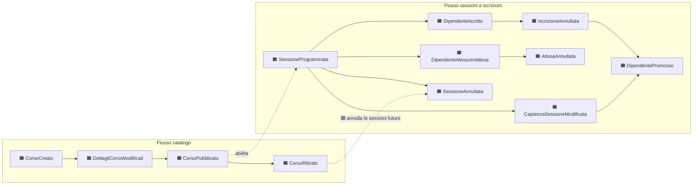

# 1. Event Storming

Primo dei quattro documenti, e **il punto di partenza del progetto**: prima di questo non
esiste nulla — nessuna specifica, nessuno schema, nessuna scelta tecnica. Si parte dal dominio
raccontato, e da lì si estraggono **eventi**, **comandi**, **attori**, **policy**,
**invarianti** e **hotspot**.

Questo documento non decide né aggregati né contesti: li *prepara*. Chiude solo ciò che è
esplorazione; tutto ciò che dichiara aperto è tracciato come hotspot con l'indicazione del
documento che lo chiuderà.

Convenzione di lingua: gli elementi del dominio hanno nomi **italiani**, gli eventi al
participio passato, i comandi all'imperativo.

---

## 1.0 Il dominio, prima di toccarlo

Ciò che segue è il materiale grezzo: come il committente descrive il proprio lavoro, con le
sue parole. Tutto il resto di questo documento — e dei tre successivi — è traduzione di
queste righe. Quando una decisione più avanti sembrerà arbitraria, il confronto è con questo
paragrafo, non con un documento intermedio.

### Il racconto

Un'azienda organizza formazione interna per i propri dipendenti.

Il **responsabile della formazione** cura un catalogo di corsi. Un corso nasce come bozza —
titolo, descrizione, durata in ore, argomento — e resta invisibile finché non viene
pubblicato. Un corso pubblicato può essere ritirato quando non è più attuale.

Di ogni corso pubblicato si programmano **sessioni**: una data, un orario di inizio, un luogo
(un'aula, o «online»), il nome del docente e un numero massimo di partecipanti. Lo stesso
corso può avere più sessioni nel tempo, e ognuna vive di vita propria.

Il **dipendente** consulta le sessioni aperte e si iscrive. Se i posti sono esauriti non viene
respinto: entra in **lista d'attesa**. Quando qualcuno annulla la propria iscrizione, il posto
liberato va al primo della lista, che viene avvisato per email di essere passato da «in
attesa» a «iscritto».

Un'iscrizione si annulla liberamente **fino a 24 ore prima** dell'inizio della sessione.
Dopo, no: chi organizza ha già ordinato i materiali e prenotato l'aula.

Il responsabile può **annullare una sessione** — il docente si è ammalato, i partecipanti sono
troppo pochi. Tutti gli iscritti e tutti quelli in lista d'attesa vengono avvisati. Se invece
è l'intero **corso a essere ritirato** dal catalogo, le sue sessioni future vengono annullate
con lo stesso effetto: le sessioni già svolte restano nello storico.

### Le regole, come le direbbe il committente

Volutamente in linguaggio d'affari, non tecnico. Tradurle è il lavoro; il §1.8 mostra il
risultato della traduzione, e i test di dominio dovranno tornare a leggersi come queste righe.

- Due corsi non possono avere lo stesso titolo.
- Non si programma una sessione di un corso che non è pubblicato.
- Una sessione ha almeno un posto.
- Nessuno si iscrive due volte alla stessa sessione.
- Non ci si iscrive a una sessione già iniziata, o annullata.
- A posti esauriti si entra in lista d'attesa, e la lista scorre in ordine di arrivo.
- Un posto che si libera va al primo in attesa, non al primo che ricarica la pagina.
- Nessuno annulla l'iscrizione di un altro.
- Passate le 24 ore prima dell'inizio, l'iscrizione non si annulla più.
- Ritirare un corso annulla le sue sessioni future, non quelle già svolte.

### Perimetro

**Dentro**: catalogo corsi, programmazione sessioni, iscrizioni, lista d'attesa, annullamenti,
notifiche.

**Fuori**, dichiarato per non farlo sembrare una dimenticanza:

- autenticazione e autorizzazione — **assenti**: il client dichiara con un header chi è, e il
  sistema gli crede; nessun ruolo, nessun permesso
- invio email reale — **adapter di log** che scrive su console il testo che manderebbe
- registrazione delle presenze, attestati, valutazioni del corso
- percorsi formativi obbligatori, scadenze di certificazione
- costi, budget, approvazione del responsabile diretto
- più fusi orari — sede singola, tutte le date e le ore sono locali
- CI, deploy, osservabilità

Il perimetro sta qui e non in un documento tecnico perché è una decisione di dominio: dice di
quali fatti il sistema è testimone, e di quali no.

---

## 1.1 Legenda

| Simbolo | Elemento | Significato |
|---|---|---|
| 🟧 | Evento di dominio | Un fatto avvenuto, al passato. Non si nega, non si annulla: se ne emette un altro |
| 🟦 | Comando | Un'intenzione, all'imperativo. Può essere rifiutata |
| 🟨 | Attore | Chi formula il comando |
| 🟪 | Policy | «Ogni volta che accade X, allora Y». Il collante fra un evento e il comando successivo |
| 🟩 | Read model | Ciò che l'attore guarda **prima** di decidere il comando |
| 🟫 | Sistema esterno | Ciò che sta oltre il confine del sistema |
| 🔥 | Hotspot | Punto di disaccordo, ambiguità o decisione non ovvia |

---

## 1.2 La timeline

Due flussi paralleli che si toccano in due punti soltanto: quando un corso viene pubblicato
(prima allora si possono programmare sessioni) e quando viene ritirato (allora le sessioni
future cadono).

### Il racconto, evento per evento

**Il responsabile prepara il catalogo.** Crea un corso: nasce in bozza, invisibile a tutti
(`CorsoCreato`). Lo rifinisce (`DettagliCorsoModificati`). Quando è pronto lo pubblica
(`CorsoPubblicato`) — è questo il fatto che rende il corso programmabile. Quando non è più
attuale lo ritira (`CorsoRitirato`).

**Il responsabile programma una sessione.** Sceglie un corso pubblicato, una data, un'ora, un
luogo, un docente e un numero di posti (`SessioneProgrammata`). Ogni sessione vive di vita
propria: due sessioni dello stesso corso non si sanno l'una dell'altra.

**Il dipendente si iscrive.** Guarda l'elenco delle sessioni aperte con i posti residui
(🟩 read model), e chiede di iscriversi. Se c'è posto è iscritto (`DipendenteIscritto`), se
non c'è entra in coda (`DipendenteMessoInAttesa`). Non è un rifiuto: è un esito diverso dello
stesso comando. Questo è il punto in cui il modello guadagna il suo stipendio.

**Il dipendente si sfila.** Se era iscritto, il posto si libera (`IscrizioneAnnullata`) e nello
stesso istante il primo della coda lo prende (`DipendentePromosso`) e viene avvisato. Se era in
coda, esce dalla coda e non si libera nulla (`AttesaAnnullata`). Dopo le 24 ore precedenti
l'inizio, il comando viene rifiutato: non c'è evento, c'è un'eccezione.

**Il responsabile cambia idea.** Può modificare la capienza: aumentandola, tanti quanti sono i
posti nuovi passano dalla coda agli iscritti (`CapienzaSessioneModificata` +
`DipendentePromosso`). Può annullare la sessione (`SessioneAnnullata`): iscritti e coda vengono
tutti avvisati. Se ritira l'intero corso, le sessioni future cadono con lo stesso effetto,
quelle già svolte restano nello storico.

---

## 1.3 Eventi di dominio

Ogni evento è un fatto già accaduto, e porta con sé tutto ciò che serve a chi lo riceve —
nessun destinatario deve interrogare a ritroso chi lo ha emesso. Il **payload esatto** di
ciascuno è definito in `architecture.md` §4.3: qui interessa il fatto, non il tracciato.

### Catalogo

| Evento | Quando | Chi lo ascolta |
|---|---|---|
| `CorsoCreato` | Un nuovo corso entra in bozza | — |
| `DettagliCorsoModificati` | Cambiano titolo, descrizione, durata o argomento | ACL iscrizioni (per il titolo replicato) |
| `CorsoPubblicato` | Il corso diventa visibile e programmabile | ACL iscrizioni |
| `CorsoRitirato` | Il corso esce dal catalogo | ACL iscrizioni, 🟪 P2 |

### Iscrizioni

| Evento | Quando | Chi lo ascolta |
|---|---|---|
| `SessioneProgrammata` | Nasce una sessione di un corso pubblicato | read model |
| `CapienzaSessioneModificata` | Il responsabile cambia il numero di posti | read model |
| `SessioneAnnullata` | La sessione non si terrà | 🟪 P4 (notifiche) |
| `DipendenteIscritto` | Un dipendente ha ottenuto un posto | read model |
| `DipendenteMessoInAttesa` | Un dipendente è entrato in coda, con la sua posizione | read model |
| `IscrizioneAnnullata` | Un iscritto si è sfilato, un posto si è liberato | read model |
| `AttesaAnnullata` | Chi era in coda è uscito dalla coda | read model |
| `DipendentePromosso` | Chi era in coda è diventato iscritto | 🟪 P3 (notifiche) |

> **Nota di modellazione.** `DipendenteIscritto` e `DipendenteMessoInAttesa` sono due eventi
> distinti e non uno solo con un campo `stato`. Sono due fatti che il committente racconta con
> due frasi diverse, e li ascoltano destinatari diversi. Un unico evento con un discriminante
> avrebbe reso il modello più corto e il linguaggio più povero.

### Ciò che non è un evento

I rifiuti. «Iscrizione duplicata», «annullamento fuori termine», «corso non pubblicato» non
sono fatti del dominio: sono comandi che non sono mai diventati fatti. Sono **eccezioni di
dominio**, elencate e tradotte in stati HTTP in `architecture.md` §4.4. Modellarli come eventi
avrebbe significato riempire lo storico di non-accadimenti.

---

## 1.4 Comandi e attori

| 🟦 Comando | 🟨 Attore | Esito atteso | Rifiuti possibili |
|---|---|---|---|
| `CreaCorso` | Responsabile | `CorsoCreato` | titolo già usato |
| `ModificaDettagliCorso` | Responsabile | `DettagliCorsoModificati` | corso ritirato, titolo già usato |
| `PubblicaCorso` | Responsabile | `CorsoPubblicato` | non è in bozza |
| `RitiraCorso` | Responsabile | `CorsoRitirato` | non è pubblicato |
| `ProgrammaSessione` | Responsabile | `SessioneProgrammata` | corso non pubblicato, capienza < 1, inizio nel passato |
| `ModificaCapienzaSessione` | Responsabile | `CapienzaSessioneModificata` (+ `DipendentePromosso`×n) | capienza < iscritti, sessione annullata o iniziata |
| `AnnullaSessione` | Responsabile, 🟪 P2 | `SessioneAnnullata` | già annullata |
| `Iscriviti` | Dipendente | `DipendenteIscritto` \| `DipendenteMessoInAttesa` | già iscritto, sessione annullata, sessione iniziata |
| `AnnullaIscrizione` | Dipendente | `IscrizioneAnnullata` (+ `DipendentePromosso`) \| `AttesaAnnullata` | non iscritto, fuori termine 24h, sessione annullata |

Gli attori sono tre, come nel racconto di §1.0. Il terzo — il **Sistema** — non è un utente:
è l'insieme delle policy della sezione seguente. Vale la pena tenerlo distinto proprio per non
attribuire a un umano ciò che accade da solo.

| 🟨 Attore | Comandi che formula |
|---|---|
| **Dipendente** | `Iscriviti`, `AnnullaIscrizione` |
| **Responsabile formazione** | tutto il catalogo, tutta la programmazione |
| **Sistema** | `AnnullaSessione` (per ritiro del corso), invio notifiche, promozione dalla coda |

---

## 1.5 Policy

| # | 🟪 Policy | Innesco | Conseguenza | Natura |
|---|---|---|---|---|
| **P1** | Un posto liberato va al primo della coda | `IscrizioneAnnullata` | `DipendentePromosso` | **Immediata**, dentro la stessa decisione — 🔥 HS-4 |
| **P2** | Ritirare un corso annulla le sue sessioni future | `CorsoRitirato` | `AnnullaSessione` × n | **Reattiva**, attraversa un confine di contesto |
| **P3** | Chi viene promosso va avvisato | `DipendentePromosso` | invio email | Reattiva |
| **P4** | Se la sessione è annullata, si avvisano iscritti e coda | `SessioneAnnullata` | invio email × n | Reattiva |
| **P5** | Il catalogo pubblicato va replicato dove serve decidere | `CorsoPubblicato`, `CorsoRitirato`, `DettagliCorsoModificati` | aggiornamento della replica locale | Reattiva |
| **P6** | Posti aggiunti scorrono la coda | `CapienzaSessioneModificata` (in aumento) | `DipendentePromosso` × n | **Immediata** — stessa ragione di P1 |

La distinzione fra **immediata** e **reattiva** non è stilistica: è la differenza fra una
garanzia transazionale e una consistenza eventuale, ed è il cuore dell'hotspot HS-4.

---

## 1.6 Read model

Ciò che gli attori guardano prima di formulare un comando. Sono deliberatamente pochi.

| 🟩 Read model | Chi lo guarda | Per decidere |
|---|---|---|
| **Sessioni aperte, con posti residui** | Dipendente | a quale sessione chiedere di iscriversi |
| **Le mie iscrizioni** | Dipendente | cosa annullare |
| **Catalogo corsi** | Responsabile | cosa pubblicare, ritirare, programmare |

> **Avvertenza che vale per tutto il resto dell'esercizio.** «Posti residui» qui è un numero
> *mostrato*, non un numero su cui si *decide*. Chi guarda l'elenco vede 1 posto libero e chiede
> di iscriversi; sarà la sessione, e solo lei, a stabilire se quel posto c'è ancora. La UI
> propone, l'aggregato dispone.

---

## 1.7 Sistemi esterni

| 🟫 Sistema | Confine | Come si presenta nell'esercizio |
|---|---|---|
| Identità aziendale (SSO) | fuori | Non c'è. L'header `X-Utente` dice quale dipendente sta chiamando — serve a INV-9, non alla sicurezza |
| Posta elettronica | fuori | Adapter di log: scrive su console il testo che manderebbe |

---

## 1.8 Invarianti emerse

Le regole dette dal committente, riscritte in forma verificabile. La colonna **custode**
è deliberatamente vuota: assegnarla è il lavoro di `aggregation.md` §3.5, ed è lì che si
scopre quali regole nessun aggregato può difendere da solo.

| # | Invariante | Custode |
|---|---|---|
| **INV-1** | Due corsi non hanno lo stesso titolo | *(→ aggregation)* |
| **INV-2** | Una sessione esiste solo per un corso pubblicato al momento della programmazione | *(→ aggregation)* |
| **INV-3** | La capienza è un intero ≥ 1 | *(→ aggregation)* |
| **INV-4** | Gli iscritti a una sessione non superano mai la capienza | *(→ aggregation)* |
| **INV-5** | Un dipendente compare al più una volta per sessione, in qualunque stato | *(→ aggregation)* |
| **INV-6** | Non si entra in una sessione già iniziata o annullata | *(→ aggregation)* |
| **INV-7** | La coda è ordinata per istante di arrivo, senza pari merito | *(→ aggregation)* |
| **INV-8** | Se ci sono posti liberi, la coda è vuota | *(→ aggregation)* |
| **INV-9** | Solo il titolare annulla la propria iscrizione | *(→ aggregation)* |
| **INV-10** | L'annullamento è ammesso solo oltre 24 ore prima dell'inizio | *(→ aggregation)* |
| **INV-11** | Ritirare un corso annulla le sessioni future, non quelle passate | *(→ aggregation)* |
| **INV-12** | Una sessione annullata non torna attiva | *(→ aggregation)* |

**INV-8 merita una riga in più.** Non è una regola che il committente ha pronunciato: è emersa
mettendo insieme «a posti esauriti si entra in lista d'attesa» e «un posto che si libera va al
primo in attesa». Se esistesse anche un solo istante in cui un posto è libero *e* la coda non è
vuota, in quell'istante un nuovo arrivato potrebbe prendere il posto scavalcando chi aspetta —
esattamente ciò che il committente ha escluso dicendo «non al primo che ricarica la pagina».
È l'invariante che decide HS-4, ed è il motivo per cui P1 è immediata e non reattiva.

---

## 1.9 Hotspot 🔥

Ogni hotspot ha un titolo, la tensione che lo genera, e il documento che lo chiuderà. Nessuno
resta aperto alla fine dei quattro documenti: la matrice di chiusura è in `architecture.md`
§4.12.

I primi sei si vedono già leggendo il racconto di §1.0: sono i punti in cui il committente non
si è pronunciato, e nessuno può decidere al posto suo per abitudine. Dal settimo in poi sono
emersi qui, srotolando la timeline.

| # | Hotspot | La tensione | Chiuso in |
|---|---|---|---|
| **HS-1** | La sessione appartiene al catalogo o alle iscrizioni? | Sembra anagrafica, ma custodisce «iscritti ≤ capienza» | `domain.md` §2.5 |
| **HS-2** | Ridurre la capienza sotto il numero di iscritti | Rifiutare, o espellere qualcuno? E chi? | `aggregation.md` §3.6 |
| **HS-3** | La coda è dentro la sessione o è un aggregato suo? | Dentro: una transazione sola. Fuori: sessione più piccola | `aggregation.md` §3.6 |
| **HS-4** | La promozione è transazionale o reattiva? | Garanzie diverse, e INV-8 ne dipende | `aggregation.md` §3.6 |
| **HS-5** | «Cambia sessione»: comando dedicato o annulla+iscriviti? | Il secondo è più onesto ma perde il posto in caso di gara | `aggregation.md` §3.6 |
| **HS-6** | Il docente è entità o attributo? | Farne un'entità apre un terzo contesto | `domain.md` §2.6 |
| **HS-7** | INV-1 (titolo unico) non è difendibile da un aggregato | Nessun corso può sapere dei titoli altrui | `aggregation.md` §3.7 |
| **HS-8** | INV-2 attraversa un confine di contesto | Chi programma non è chi possiede lo stato del corso | `domain.md` §2.7 |
| **HS-9** | Che ne è della coda quando la sessione inizia? | Nessuno la promuove più: restano appesi | `aggregation.md` §3.8 |
| **HS-10** | Da dove prende l'indirizzo, chi notifica? | Notifiche non ha un'anagrafica, e nel sistema non ce n'è nessuna da interrogare | `domain.md` §2.8 |
| **HS-11** | Chi ha il permesso di annullare cosa | INV-9 è una regola di dominio o un controllo di accesso? | `aggregation.md` §3.9 |
| **HS-12** | Un corso ritirato e ripubblicato: le sessioni tornano? | L'annullamento è un fatto, ma il ritiro potrebbe essere un errore | `aggregation.md` §3.8 |
| **HS-13** | Si modifica data, luogo o docente di una sessione programmata? | Il committente non l'ha detto, e cambia le notifiche | `aggregation.md` §3.8 |
| **HS-14** | Aumentare la capienza scorre la coda? | Non richiesto esplicitamente, ma INV-8 lo impone | `aggregation.md` §3.6 |

---

## 1.10 Cosa questo documento lascia aperto

Debiti dichiarati, ciascuno con il suo creditore. La regola d'igiene dell'esercizio è che un
passo dichiarato va poi eseguito: questa lista è ciò contro cui verificarlo.

| Debito | Verso |
|---|---|
| Assegnare ogni invariante INV-1…INV-12 a un custode | `aggregation.md` §3.5 |
| Chiudere tutti i 14 hotspot con decisione e motivazione | `domain.md`, `aggregation.md` |
| Sottodomini, bounded context e context map | `domain.md` |
| Aggregati, entità, value object, cicli di vita | `aggregation.md` |
| **Schema dati di ogni comando** | `architecture.md` §4.2 |
| **Payload di ogni evento e nome sul bus** | `architecture.md` §4.3 |
| Elenco delle eccezioni di dominio e loro stato HTTP | `architecture.md` §4.4 |
| Forma dei due read model e rotte che li servono | `architecture.md` §4.5, §4.6 |
| Forma della persistenza, lock ottimistico, propagazione degli eventi | `architecture.md` §4.7, §4.8 |
| Guardiani automatici e strategia di test | `architecture.md` §4.9, §4.10 |
